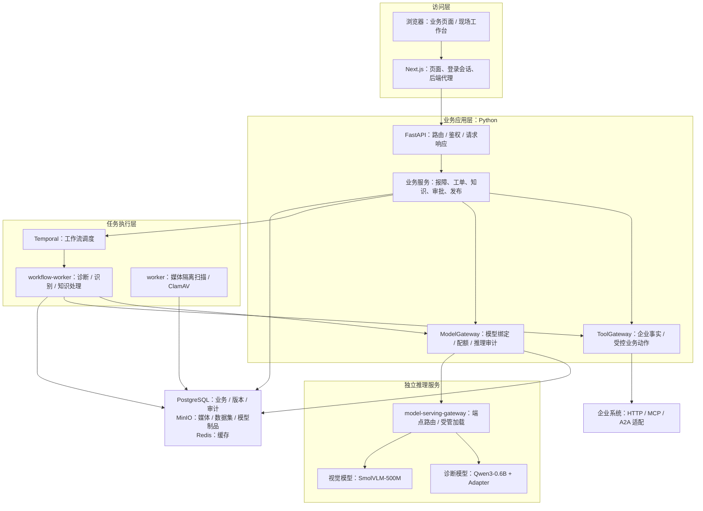

# 企业级多模态工业设备智能运维与售后 Agent 平台

面向设备报障、故障诊断、维修履约和售后数据反馈的全栈项目。它把现场图片与文本、企业知识和业务系统事实连接到模型推理，再通过人工确认、审批与工单完成业务闭环。

项目由“cpp辅导的阿甘”开发。第三方、上游和既有贡献的权利仍以各自声明及 Git 历史为准；本署名不替代许可证。[pyproject.toml](pyproject.toml) 当前声明为 `Proprietary`。


## 阅读导航

**按目的找入口：**

| 我想…… | 直接去 |
|---|---|
| 知道这个项目能做什么 | [项目能力与使用入口](#capabilities) |
| 理解整体结构和分层 | [项目架构](#architecture) |
| 上手读代码 | [代码目录与模块职责](#code-structure) → [从哪里开始读代码](#code-structure) |
| 把环境跑起来 | [环境准备与部署](#deployment) → [首次部署](#deployment) |
| 完整走一遍业务流程 | [走通一次业务流程](#business) |
| 训练 / 评测 / 发布模型 | [数据反馈、训练、评测与发布](#training) |
| 排查某个具体故障 | [运行维护与排障](#operations) |

**按章节：** [项目能力](#capabilities) · [项目架构](#architecture) · [代码目录](#code-structure) · [大模型、OCR 与微调](#models) · [环境准备与部署](#deployment) · [走通业务流程](#business) · [训练与发布](#training) · [实时多模态](#extensions) · [维护方案匿名评审](#review) · [运行维护与排障](#operations) · [开发、交付与资料保留](#delivery)

<a id="capabilities"></a>
## 项目能力与使用入口

页面是否可操作取决于登录主体、租户、业务状态及对应服务是否配置完成。根路径 `/` 跳转到 `/workspace`；未登录时进入 `/login`。

| 业务域 | 主要能力 | 页面入口 |
|---|---|---|
| 工作台与设备 | 角色工作台、设备选择、设备族配置 | `/workspace`、`/assets/select`、`/device-families` |
| 报障与诊断 | 故障草稿、上传、识别复核、引用溯源、诊断和复诊 | `/incidents/new`、`/incidents` |
| 维修履约 | 服务授权、报价、派工、接单、现场记录、完工、独立验收、关闭 | `/entitlements`、`/dispatch`、`/field`、`/work-orders` |
| 审批与售后 | 高风险提案审批、采购/退款/通知回执、客户确认、异常对账 | `/approvals`、`/portal`、`/reconciliations`、`/parts` |
| 企业知识 | 文本/Markdown 录入，TXT/Markdown/PDF 上传、审核、索引发布、删除传播 | `/ai/knowledge` |
| 检索与协作 | GraphRAG、OpenSearch 搜索 Profile、外部检索、供应商与专家协作 | `/ai/knowledge/graph`、`/ai/knowledge/search`、`/ai/knowledge/external`、`/collaboration`、`/expert/collaborations` |
| 数据与模型 | 数据治理、标注复核、数据集快照、实验、模型评测、提示词、发布与部署 | `/ai/datasets`、`/ai/experiments`、`/ai/prompts`、`/ai/releases` |
| 企业资产与记忆 | 模型和评测证据导入、人工确认的业务记忆 | `/ai/enterprise-assets`、`/ai/memories` |
| 预测维护 | 遥测接入、趋势/异常候选、时序 Transformer、剩余寿命 RUL | `/predictive-maintenance` |
| 维护规划 | 单 Agent / 多 Agent 方案、人工复核、匿名 A/B 评审 | `/maintenance-planning`、`/maintenance-planning/reviews` |
| 治理与运维 | 租户权限、安全审计、紧急只读访问、恢复、供应链、成本、追踪、GPU 运维 | `/tenant`、`/security`、`/ops` 及其子页面 |

这些能力不是一次启动全部加载的要求。数据平台、训练、语音、图检索和生产基础设施有各自依赖；小模型图片诊断链路不代表所有专项模型均已部署。

<a id="architecture"></a>
## 项目架构

### 总体分层

项目采用**模块化业务后端 + 独立任务进程 + 独立模型服务**。多数业务模块位于同一个 Python 包中，共享运行时组装与持久化基础；它不是“每个业务目录对应一个微服务”，也不是浏览器直接调用模型的聊天应用。

下面展示主要逻辑依赖，不是容器数量图；例如 `ModelGateway` 和 `ToolGateway` 是被 API / Worker 使用的 Python 组件，不各自代表一个必需的独立容器。



PaddleOCR 由识别 Worker 中的 Release-bound Provider 执行，不是图中的 VLM 推理端点。Neo4j、OpenSearch、实时音视频与数据训练平台按功能另行接入；上图没有将它们画成小模型诊断的必备组件。

### 服务进程与部署边界

| 进程 / 服务 | 主要职责 | 代码入口或定义 |
|---|---|---|
| `web` | 页面、服务端登录会话、API 代理；不是模型运行进程 | `web/app/`、`web/lib/auth/` |
| `api` | HTTP API、业务状态变更、查询、任务提交和事件流 | `main.py` → `runtime.py` → `api/app.py` |
| `worker` | 扫描隔离媒体、记录扫描结果；不负责诊断生成 | `media/runner.py` |
| `workflow-worker` | 消费 Temporal 任务，执行诊断、识别、知识与规划 Activity | `orchestration/runner.py`、`orchestration/workflows.py` |
| `model-serving-gateway` 与模型服务 | 接收推理请求、路由至匹配端点；受管路径协调模型加载 / 卸载 | `model_gateway/router_runtime.py`、`model_gateway/owned_runtime.py` |
| `event-worker` / `telemetry-worker` | 消费反馈 / 遥测事件，衔接数据治理和预测维护 | `event_worker/consumer.py`、`predictive_maintenance/consumer.py` |
| 数据任务进程 | Airflow 编排、Spark 数据处理、快照发布与血缘上报 | `airflow/dags/`、`data_pipeline/` |
| 训练 / 量化 / 评测 Worker | 执行已登记任务，写回制品、指标及评测结果；不在用户诊断时重新训练 | `training/`、`evaluation/` |
| 部署控制器 | 依据 Release 和部署记录管理模型部署状态 | `deployment/cli.py` |
| 实时媒体服务（可选） | 实时音视频会话与媒体传输，配合 API 和 ASR / TTS 能力 | `realtime_media/server.py`、`compose.realtime.yaml` |

表中未带 `web/`、`airflow/` 等根目录前缀的 Python 路径均相对于 `src/industrial_ops_agent/`。这些进程并非全部由基础 Compose 同时启动，具体服务集合见[部署说明](#deployment)。Web、API、数据库可运行在普通节点；实际 GPU 推理与训练安排在对应计算节点。

### 业务、数据与模型如何闭环

- **在线业务**：报障 / 上传 → 隔离扫描 → OCR / VLM 候选 → 人工确认 → 授权知识与企业事实检索 → LLM 诊断 → 审批、维修、独立验收和关闭。扫描、识别、确认、诊断是不同状态，不能互相代替。
- **数据反馈**：工单关闭 → Outbox → Debezium / Kafka → 数据治理、脱敏、标注 → Airflow / Spark → Parquet + Manifest → OpenLineage → 数据集快照。
- **模型迭代**：已授权快照 → 实验 / MLflow → 训练制品 → 独立评测 → Release / 审批 → Deployment / 路由激活 → 新业务请求使用绑定的模型和提示词。

这三条链路共享业务标识和版本记录，但执行时机独立。一次诊断不会自动触发训练；生成一个 Adapter 也不会自动替换在线模型。

### 贯穿各层的机制

- **身份与租户**：NextAuth / Keycloak 管理登录，API 校验身份，授权组件结合 OPA 判定权限。SQLAlchemy 事务设置租户上下文，PostgreSQL RLS 与业务授权共同限制数据访问。
- **动作与证据**：ToolGateway 对读取、提案与执行分别授权，保留幂等、审批、外部回执和对账；模型建议不是执行凭证。模型发布与业务操作的审批各有职责。
- **配置与密钥**：`Settings` 管理配置，SecretProvider / Vault 提供密钥。模型和业务容器是否自动注入取决于所选部署配置，见[密钥与启动说明](#deployment)。
- **可观测性**：请求标识、Agent 事件、推理审计与 OpenTelemetry 串联业务过程；Prometheus / Grafana、Tempo、Loki 和可选 Langfuse 承接指标、日志与追踪。

<a id="code-structure"></a>
## 代码目录与模块职责

### 仓库目录

以下是源码中的主要目录
```text
damoxing/
├── README.md                      # 项目介绍、架构、配置、启动与运维入口
├── pyproject.toml / uv.lock       # Python 包、CLI、可选依赖及版本锁定
├── pnpm-workspace.yaml / pnpm-lock.yaml   # 前端工作区与依赖锁定
├── Makefile                       # 常用命令入口
├── compose.lite.yaml              # 基础业务与基础设施
├── compose.real-model.yaml        # 真实模型服务与业务连接覆盖层
├── compose.integration.yaml       # 数据、训练、评测等集成服务
├── compose.realtime.yaml          # 实时媒体扩展
├── compose.observability.yaml     # 可观测性扩展
├── compose.ai.yaml                # 历史 AI 覆盖层；兼容限制见部署说明
├── src/
│   └── industrial_ops_agent/      # 后端、Worker、训练与模型运行代码
│       ├── main.py                # API 进程启动
│       ├── runtime.py             # 数据库、授权、网关等运行依赖组装
│       ├── config.py              # 配置定义与校验
│       ├── api/                   # FastAPI 应用、路由、依赖和错误转换
│       ├── application/           # 报障、诊断等应用用例
│       ├── domain/                # 领域数据结构与基础约定
│       ├── persistence/           # ORM、事务与持久化记录
│       ├── orchestration/         # Temporal 工作流与 Activity
│       └── …                      # 按业务划分的包，见下表
├── web/                           # Next.js 前端与服务端 API 代理
├── alembic/versions/              # 数据库结构演进；不等于临时脚本
├── airflow/dags/                  # 数据流水线调度定义
├── scripts/                       # 启动、制品打包、绑定和运维 CLI 辅助
├── docker/                        # 各进程镜像定义、依赖锁和启动脚本
├── infra/                         # Helm、Terraform、KServe、Vault、OPA 等配置
├── contracts/                     # OpenAPI、事件 Schema 及历史证据兼容资料
├── datasets/                      # 项目数据与模型任务使用的样本 / 契约
├── docs/m5-release/               # 保留的 JSON / JSONL 数据与配置输入
├── acceptance/                    # 项目业务闭环验收清单等输入
└── .github/workflows/             # 仓库自动化与供应链工作流
```

### 后端按业务划分的模块

下列目录均位于 `src/industrial_ops_agent/`；表中的分组是阅读分类，不是新增的目录层。业务规则分布在各业务包的 `service.py` 及相关模块中，并没有一个包揽所有业务的 `services/` 目录。

| 模块组 | 主要目录 / 文件 | 职责与边界 |
|---|---|---|
| HTTP 与应用用例 | `api/`、`application/`、`domain/` | 协议处理、报障与诊断用例、领域结构；路由调用服务，不把 ORM 原样交给前端 |
| 维修与售后 | `workorders/`、`parts/`、`service_entitlements/`、`customer_portal/`、`incident_operations/`、`service_performance/` | 履约状态机、备件、服务权益、客户确认和业务运营 |
| 受控工具与审批 | `tools/`、`tool_governance/`、`approval/` | 工具调用、变更提案、审批、回执与幂等 |
| Agent 与任务编排 | `agent/`、`orchestration/` | Agent 事件 / 检查点 / 专项运行逻辑，以及 Temporal 工作流；与 HTTP 生命周期分离 |
| 维护规划与协作 | `maintenance_planning/`、`collaboration/` | 维护方案、匿名评审、跨主体协作；不等同于基础故障诊断 |
| 知识与检索 | `knowledge/`、`graph_rag/`、`search_profiles/`、`external_search/`、`memory_governance/` | 文档入库、索引发布、授权检索、图谱、检索 Profile、外部引用和人工确认记忆 |
| 媒体与多模态 | `media/`、`multimodal/`、`realtime_media/` | 隔离扫描、OCR / VLM / ASR / TTS、识别复核、实时会话；分别维护各阶段结果 |
| 推理与提示词 | `model_gateway/`、`guardrails/`、`prompting/`、`prompt_governance/` | 模型解析、推理请求、输出约束、提示词版本和发布 |
| 实验与训练 | `experiments/`、`training/`、`evaluation/`、`model_methods.py` | 实验任务、训练 / 量化、制品处理和评测；保留不同算法的任务与指标 |
| 模型发布与供应链 | `releases/`、`deployment/`、`enterprise_assets/`、`model_evidence/`、`supply_chain/` | Release / Manifest、部署、跨租户资产导入、只读证据与供应链验证 |
| 数据反馈与治理 | `eventing/`、`event_worker/`、`data_governance/`、`labeling/`、`data_pipeline/` | Outbox / 消费、脱敏授权、标注和快照构建；不是在线推理代码 |
| 预测维护与设备 | `predictive_maintenance/`、`device_families/`、`edge/` | 遥测、时序 / RUL、设备族和边缘能力 |
| 身份与安全 | `auth/`、`security/`、`tenant_administration/`、`security_audit.py` | 身份、授权、租户管理和安全审计 |
| 持久化与配置 | `persistence/`、`object_store/`、`cache/`、`config.py`、`secrets.py`、`migrate.py`、`seed.py` | 事务、对象存储、缓存、配置、迁移与初始数据 |
| 运维与观测 | `operations/`、`trace_operations/`、`gpu_operations/`、`cost_operations/`、`recovery/`、`assurance/`、`telemetry.py`、`observability.py`、`runtime_metrics.py` | 运维查询、追踪、成本、资源操作、恢复和观测 |
| 专项实验与接入支撑 | `simulation/`、`sandbox/`、`supplier_sandbox/`、`project_acceptance/`、`staging_acceptance/` | 实验执行、外部系统联调、项目接入和暂存证据流程；不是可以整目录删除的无用示例 |

`simulation/` 中仍有正式入口或证据流程使用的代码，不能把其目录名理解为在线模型的“开发夹具模式”。`model_evidence/` 承担证据读取与验证，也不是模型权重目录。

### 前端代码结构

```text
web/
├── app/                           # Next.js App Router
│   ├── layout.tsx / page.tsx      # 根布局与入口重定向
│   ├── login/ / workspace/        # 登录与角色工作台
│   ├── api/
│   │   ├── auth/                  # NextAuth 登录接口
│   │   └── backend/[...path]/     # 浏览器到 FastAPI 的服务端代理
│   ├── incidents/                 # 报障、识别复核、诊断
│   ├── field/ / work-orders/      # 现场执行与工单管控
│   ├── approvals/ / portal/       # 审批与客户门户
│   ├── ai/                        # 知识、数据集、实验、提示词、Release
│   ├── maintenance-planning/      # 维护方案与匿名评审
│   ├── predictive-maintenance/    # 预测维护
│   ├── ops/ / tenant/ / security/ # 运维、租户与安全
│   └── …                          # 设备、备件、派工、协作等业务页面
├── components/                    # 复用的业务界面与模型状态组件
├── lib/
│   ├── api/client.ts              # 类型化业务请求与事件流处理
│   ├── auth/                      # 会话配置、身份类型与登录要求
│   ├── field-evidence-drafts.ts   # 本机现场证据草稿
│   └── field-offline-pack.ts      # 离线工单包及存储逻辑
├── auth.ts                        # 服务端获取当前登录会话的入口
├── generated/api/schema.d.ts      # OpenAPI 生成类型；不是手写业务逻辑
├── public/                        # 静态资源
├── package.json                   # 前端命令与依赖
└── next.config.ts / tsconfig.json
```

页面 URL 来自 `app/` 目录；业务请求集中在 `lib/api/client.ts`，通过 `app/api/backend/[...path]/route.ts` 转发到后端。代理从服务端会话取得访问令牌并转发幂等、版本和追踪头。现场离线草稿仍需上传、扫描和显式关联，不因存进浏览器就变成平台业务证据。

### 用一次诊断串起代码

| 环节 | 实际代码与行为 |
|---|---|
| 页面提交 | `web/lib/api/client.ts:startDiagnosis` 发起请求，经 Next.js 后端代理进入 API |
| API 接入 | `api/routes/diagnoses.py:start_diagnosis` 解析请求、身份与版本条件，调用应用服务 |
| 创建任务 | `application/diagnoses.py:DiagnosisService` 校验权限、幂等和模型绑定，保存状态并通过 Dispatcher 提交工作流 |
| 异步执行 | `orchestration/runner.py` 注册 Worker；`orchestration/workflows.py` 中的 `DiagnosisWorkflow` 执行 `DiagnosisActivity` |
| 整理依据 | Activity 从知识检索、企业工具和允许使用的业务上下文获取事实，按 Manifest 绑定提示词 |
| 模型生成 | Activity 调用 `ModelGateway`，经匹配的服务端点获取模型输出，校验结构、引用和执行结果 |
| 结果展示 | 结果、Agent 事件与检查点写回；页面通过查询 / 事件流显示进度和报告，后续业务动作另行确认 |

`agent/graph.py` 中有 LangGraph 实现，但当前正式诊断的实际模型调用位于 `DiagnosisActivity`。因此排查“页面为什么没有调用模型”应沿以上链路定位，不能只看图定义或模型容器是否启动。

### 从哪里开始读代码

| 想理解的部分 | 优先阅读 |
|---|---|
| 应用组装与环境配置 | [runtime.py](src/industrial_ops_agent/runtime.py)、[config.py](src/industrial_ops_agent/config.py)、[api/app.py](src/industrial_ops_agent/api/app.py) |
| API、权限与事务 | [api/routes/](src/industrial_ops_agent/api/routes/)、[auth/](src/industrial_ops_agent/auth/)、[persistence/database.py](src/industrial_ops_agent/persistence/database.py) |
| 一次诊断如何执行 | [application/diagnoses.py](src/industrial_ops_agent/application/diagnoses.py) → [orchestration/workflows.py](src/industrial_ops_agent/orchestration/workflows.py) |
| 扫描与多模态识别 | [media/runner.py](src/industrial_ops_agent/media/runner.py)、[orchestration/runner.py](src/industrial_ops_agent/orchestration/runner.py)、[multimodal/providers.py](src/industrial_ops_agent/multimodal/providers.py) |
| RAG 与知识发布 | [knowledge/](src/industrial_ops_agent/knowledge/)、[graph_rag/](src/industrial_ops_agent/graph_rag/)、[search_profiles/](src/industrial_ops_agent/search_profiles/) |
| 现场执行和业务副作用 | [workorders/service.py](src/industrial_ops_agent/workorders/service.py)、[tools/gateway.py](src/industrial_ops_agent/tools/gateway.py) |
| 推理、制品与发布 | [model_gateway/](src/industrial_ops_agent/model_gateway/)、[training/](src/industrial_ops_agent/training/)、[evaluation/](src/industrial_ops_agent/evaluation/)、[releases/](src/industrial_ops_agent/releases/)、[deployment/](src/industrial_ops_agent/deployment/) |
| 页面与 API 客户端 | [web/app/](web/app/)、[web/lib/api/client.ts](web/lib/api/client.ts)、[web/components/](web/components/) |
| 实际启动与基础设施 | [Makefile](Makefile)、[scripts/](scripts/)、[docker/](docker/)、[infra/](infra/) |

<a id="models"></a>
## 大模型、OCR 与微调在哪里使用

### 当前小模型方案

| 组件 | 业务职责 | 实现与绑定 |
|---|---|---|
| PaddleOCR | 从铭牌、报警截图和文档中提取文字 | `ReleaseBoundOcrProvider` 校验 Release 组件，再执行真实 OCR |
| SmolVLM-500M-Instruct | 静态图片中的视觉观察候选 | `GatewayVlmProvider` → Gateway 的 `VLM` 请求；固定来源见 [SmolVLM 清单](infra/model-runtime/smolvlm-500m.json) |
| Qwen3-0.6B + 微调 Adapter | 综合故障描述、授权引用与企业事实，生成结构化诊断 | `DiagnosisActivity` → Gateway 的 `DIAGNOSIS` 请求；实际 Adapter 由部署制品绑定 |
| Prompt Bundle | 规定任务、风险处理、变量与输出结构 | [版本注册表](src/industrial_ops_agent/prompting/registry.py)与 Release Manifest 共同绑定，不以文件名或页面标题判断生效版本 |

这里的微调不是每次诊断都重新训练：训练 Worker 事先生成 Adapter，部署时加载基础模型和 Adapter，业务请求使用部署后的版本。Transformer 在底层语言/视觉模型中使用，也在预测维护的原生 PyTorch 时序模型中使用。

[低资源模型运行时](src/industrial_ops_agent/model_gateway/owned_runtime.py)已识别 SmolVLM 基础制品与 Qwen3-0.6B 微调打包方案；[路由器](src/industrial_ops_agent/model_gateway/router_runtime.py)的受管加载路径支持串行加载/卸载，降低模型同时驻留的需求。当前 SmolVLM 路径限制单张图片、不接收视频，不能据此宣称多帧视频模型已可用。

模型服务所在节点需要与运行镜像匹配的 GPU 环境；浏览器、Web、API、数据库并不都需要 GPU，也不必与模型部署在同一台机器。所附真实模型启动脚本检查本机 NVIDIA GPU，因此不能直接用它管理纯远程 GPU 部署。显存、内存和磁盘需求由模型、上下文、并发、镜像及启动的服务集合决定；本仓库不承诺任意低配置机器可运行全套服务。

### 环境与真实调用的判断

- 暂存：`IOAP_MODEL_GATEWAY_REQUIRED_ENVIRONMENT=STAGING`，诊断与图片别名为 `industrial-diagnosis-staging`。
- 生产：`PRODUCTION` 与 `industrial-diagnosis`，同时满足生产配置、审批、供应链和部署要求。
- `PROJECT_STAGING_REAL` 是项目暂存真实运行的分类，不等于生产验收，也不是“夹具/真实模型”切换开关。
- 当前配置拒绝旧的 `IOAP_MODEL_GATEWAY_ENABLED`、`IOAP_MODEL_GATEWAY_TRANSPORT`、`IOAP_OCR_PROVIDER` 及旧 Ollama 选择参数。不要从历史说明复制这些变量。
- OCR、VLM、诊断必须匹配目标租户、Release、Manifest、Deployment 和端点；缺少模型或授权证据时返回具体失败，不用固定答案补成功。

查看当前绑定使用 `GET /api/v1/model-gateway/runtime-status` 和 `GET /api/v1/model-gateway/routes`；推理记录位于 `GET /api/v1/model-gateway/inferences`。这些接口需要相应权限。

页面的“真实模型已参与”依据服务端成功推理记录及当前绑定判断。应能追溯 Release、Deployment、Inference Request ID、处理器、耗时、Token 和 Guardrail 结果。服务 `READY`、识别确认或训练完成，都不能单独证明一次业务已使用新模型；实际提示词以该诊断的 Manifest 为准。

<a id="deployment"></a>
## 环境准备与部署

### 软件与源码

命令在 Linux / WSL 的仓库根目录执行。维护者主目录为 `/home/codex/damoxing`；其他机器使用自己的克隆目录，不需要同名路径或 WSL。

| 用途 | 仓库要求 |
|---|---|
| 后端开发 | Python 3.11～3.13、uv；版本约束见 [pyproject.toml](pyproject.toml)，解析结果见 [uv.lock](uv.lock) |
| 前端开发 | Node.js 22 或更高、pnpm 11.20.0；见 [web/package.json](web/package.json) |
| 容器与脚本 | Docker Compose 插件、Bash、make、curl、zip |
| 本地真实模型 | NVIDIA 驱动、`nvidia-smi`、容器 GPU 支持、匹配的模型镜像与制品 |
| Kubernetes 部署 | 已准备的集群、GPU 调度/驱动、KServe 和所选 Helm/GitOps 依赖 |

所附构建缓存脚本使用 Linux x86_64 JRE 归档；不要把它当作已经适配 ARM 的构建入口。

```bash
uv sync --locked --extra dev --extra data-pipeline
pnpm --dir web install --frozen-lockfile
make m1-init
```

`m1-init` 生成或补齐 `.env.m1.local`，权限为 `0600`，保留已有凭据；它**不下载模型、不训练、不创建 Release、不完成业务绑定**。`M1_RUNTIME_ENV_FILE` 可指定仓库内另一个相对路径，后续命令必须使用同一文件及 Compose 项目。

需要从源码构建相关镜像时，再准备 Dockerfile 使用的本地依赖：

```bash
.venv/bin/python -m ensurepip
./scripts/m3_prepare_build_cache.sh
```

这会下载并生成被 Git 忽略的 `.docker-cache/m3`。当前基础 API 还挂载其中指定版本的 Pillow wheel，故“已有 API 镜像”并不一定意味着可删除所有宿主构建缓存；以实际 Compose 挂载为准。

### 选择部署文件

| 文件 | 用途及注意事项 |
|---|---|
| [compose.lite.yaml](compose.lite.yaml) | Web/API、扫描与工作流 Worker、PostgreSQL、Redis、MinIO、Keycloak、Vault、ClamAV、OPA、Temporal 和企业沙箱；名称 Lite 不代表单进程或轻量依赖 |
| [compose.real-model.yaml](compose.real-model.yaml) | GPU 模型、模型路由和业务别名覆盖；需要实际镜像、模型路径、密钥和已登记绑定 |
| [compose.integration.yaml](compose.integration.yaml) | Kafka/Debezium、标注、Airflow/Spark、血缘、MLflow、训练/评测 Profile；同时打开 GraphRAG/OpenSearch 配置，不是只加消息队列 |
| [compose.realtime.yaml](compose.realtime.yaml) | aiortc 媒体服务、Coturn 和实时信令；默认地址为 localhost，跨机器需调整 |
| [compose.observability.yaml](compose.observability.yaml) | OTel Collector、Prometheus、Grafana、Tempo、Loki；保留部署所需的基础/集成覆盖层 |
| [infra/helm/](infra/helm/) / [infra/terraform/aws/](infra/terraform/aws/) | Kubernetes 应用、模型平台、GitOps、密钥、观测、恢复及 AWS 基础设施；不属于本地使用的必装依赖 |

**不要直接叠加旧的 [compose.ai.yaml](compose.ai.yaml)**：它仍设置已被 `Settings` 拒绝的旧模型开关。需要 PaddleOCR 时，应在实际部署覆盖层选择具备 `local-ai` 依赖的 [AI Worker 镜像](docker/ai-worker.Dockerfile)，并绑定匹配的 OCR 组件；基础工作流镜像并不包含完整 PaddleOCR 环境。本文不通过修改配置或绕过校验掩盖该差异。

### 首次部署与已有实例恢复

当前仓库**不是“克隆后执行一个命令即可获得完整模型业务”的安装包**。首次部署需要依次完成：

1. 准备基础服务与私密配置，执行当前版本数据库迁移、运行角色初始化、对象存储初始化和目标租户/资产准备。Compose 的 `migrate` 使用 [迁移入口](src/industrial_ops_agent/migrate.py)升级到 `head`；不要照抄旧固定 revision。
2. 准备 Qwen3-0.6B 基础模型与 Adapter、SmolVLM 固定 revision、OCR 资源、匹配的镜像和模型卷。代码仓库不携带这些运行制品。
3. 使用授权 API/工作台将模型和真实评测证据登记到**业务租户**，完成对应 Release、审批和 Deployment。实验租户记录 ID 不能直接替代业务租户记录。
4. 配置模型服务、Vault 注入和路由，使 Release/Manifest/端点/配额一致，再启动具备相应依赖的业务 Worker。
5. 使用实际账号上传识别、发起诊断，核对请求对应的推理记录。模型上线与业务质量验收分别记录。

上述步骤是部署顺序，不是声称所有工作已由某个初始化脚本自动完成。相关业务入口见[训练与发布](#training)。

[real_model_business_loop.sh](scripts/real_model_business_loop.sh)只使用基础和真实模型两份 Compose，且在 `up` 前要求 API 的 Gateway 状态已经 `READY`；因此不能承担空环境的首次完整部署。其参数含义如下：

| 操作 | 实际行为 |
|---|---|
| `preflight` | 检查配置、镜像 digest、宿主/容器 GPU、在线 Gateway 和路由；会启动一次 GPU 探针容器 |
| `up` | 前置检查通过后执行 Compose 构建和启动，再检查绑定 |
| `bind` | **只检查现有绑定**并报告 `REAL_MODEL_BINDING_READY`，不创建 Release/Deployment、不写入新路由 |
| `verify` | 检查上述条件及当前 Release 已有的成功 `VLM`/`DIAGNOSIS` 审计，不自动发起业务旅程 |
| `down` | 仅限 STAGING，停止并移除固定的七个业务/模型容器，保留卷和基础服务 |

使用该脚本前，运行配置还须提供：

| 配置 | 含义 |
|---|---|
| `IOAP_DIAGNOSIS_MODEL_IMAGE`、`IOAP_VLM_MODEL_IMAGE`、`IOAP_MODEL_ROUTER_IMAGE`、`IOAP_GPU_PROBE_IMAGE` | 均为实际 `仓库@sha256:...` 镜像引用 |
| `IOAP_DIAGNOSIS_MODEL_ID`、`IOAP_DIAGNOSIS_MODEL_PATH` | 诊断模型 ID 与登记一致，路径为容器内绝对路径 |
| `IOAP_VLM_MODEL_ID`、`IOAP_VLM_MODEL_PATH` | VLM 模型 ID 与登记一致，路径为容器内绝对路径 |
| `IOAP_MODEL_GATEWAY_REQUIRED_ENVIRONMENT`、`IOAP_MODEL_GATEWAY_ALIAS`、`IOAP_VLM_MODEL_ALIAS` | 目标环境与业务别名 |
| `IOAP_REAL_MODEL_API_URL` | 脚本可访问的 API 前缀，默认 `http://127.0.0.1:8000/api/v1` |
| `IOAP_REAL_MODEL_ACCESS_TOKEN_FILE` | 有相应权限的有效 API 访问令牌文件，权限 `0600`；不是登录密码或模型服务密钥 |

仅当已有标准部署满足这些条件、且没有额外私密覆盖层时使用：

```bash
make m1-up
make m1-status
```

已有实例必须沿用**相同的项目名、完整 Compose 文件列表、顺序、镜像及卷挂载**。不要用上述标准命令覆盖自定义运行配置，也不要把本机私密部署文件当作已包含在 Git 中。

### 密钥与访问地址

应用通过 [SecretProvider](src/industrial_ops_agent/secrets.py)读取秘密。基础 Compose 使用 Vault，运行管理器维护应用令牌和 Web 会话密钥。

模型服务的持久化注入实现位于 [model-secret-sync.sh](infra/vault/model-secret-sync.sh)和 [model-secret-entrypoint.py](docker/model-secret-entrypoint.py)：同步器从 Vault 读取 `model_gateway_api_key`，写入受限共享目录，服务入口等待就绪后再启动。交付覆盖层须实际连接同步开关、目录卷、入口命令与 `IOAP_MODEL_GATEWAY_API_KEY_FILE`；**基础真实模型覆盖层的环境型 Compose Secret 本身不等于已接好 Vault 自动注入**。

默认访问地址：

| 服务 | 地址 / 端口参数 |
|---|---|
| 业务页面 | <http://localhost:3000> / `M1_WEB_PORT` |
| API | 真实模型覆盖层映射 <http://127.0.0.1:8000> / `M1_API_PORT`；基础 Compose 不单独暴露该端口 |
| Keycloak | <http://localhost:8080> / `M1_KEYCLOAK_PORT`，Realm `industrial-ops` |
| MinIO 控制台 | <http://localhost:9001> / `M1_MINIO_CONSOLE_PORT` |
| Label Studio / Airflow / MLflow | 集成部署后分别为 8081 / 8082 / 5000，参数为 `M3_LABEL_STUDIO_PORT` / `M3_AIRFLOW_PORT` / `M4_MLFLOW_PORT` |

共享或远程访问时同步配置 Web 的 `NEXTAUTH_URL`、Keycloak issuer/回调、API 可达地址及媒体 Origin，使用 HTTPS/WSS；不要只改浏览器地址而保留内部 localhost 假设。当前代码在非生产环境开放 `/docs` 和 `/openapi.json`，`IOAP_ENVIRONMENT=production` 时关闭；没有单独的 `IOAP_EXPOSE_API_DOCS` 开关。

[本地 Realm](infra/keycloak/m1-realm.json)提供以下账号：

| 账号 | 角色 |
|---|---|
| `local-demo-admin` | 本地多角色浏览和操作 |
| `m1-engineer` | 现场工程师 |
| `m1-tenant-admin` | 租户管理员 |
| `m3-data-steward` | 数据治理 |
| `m7-after-sales` / `m7-domain-expert` | 售后工程师 / 领域专家 |
| `m6-security-auditor` / `m6-platform-operator` | 安全审计员 / 平台运维 |

首次 Realm 导入的本地密码取运行文件中的 `M1_DEMO_USER_PASSWORD`，请在本机编辑器中查看该项。已在 Keycloak 修改过密码时，以身份服务为准；改环境文件不会重置已导入用户。Keycloak 管理账号、MinIO 管理账号、Label Studio 的 `m3-data-steward@local.invalid` 均为独立账号体系；Label Studio 密码取 `M3_LABEL_STUDIO_PASSWORD`，Airflow 认证以部署配置为准。

多角色账号不能绕过“申请人与审批人不同”“维修人与验收人不同”。共享环境应分配独立身份，不传播完整环境文件或密码截图。

<a id="business"></a>
## 走通一次业务流程

先准备可用模型绑定、目标租户设备和已发布知识；以下是操作路线，不是自动验收脚本。

1. **报障**：登录后选择设备，在 `/incidents/new` 创建故障草稿，填写实际现象、时间和设备信息。
2. **上传与识别**：上传 JPG/PNG 等受支持媒体；先完成隔离扫描，再发起识别。逐项接受、修正或拒绝 OCR/视觉候选，并确认故障信息。
3. **发起诊断**：系统检索当前用户有权访问且适用于设备的知识，读取有来源及事实时间的企业数据，通过 Gateway 调用模型。报告包含结论、引用、冲突、缺失信息及后续检查；证据不足不应当作合格结论。
4. **组织维修**：根据业务授权、报价及审批创建/派发工单；有备件的路径处理出库、消耗和退料。页面按钮以服务端 `legal_actions` 为准。
5. **现场执行**：工程师进入 `/field` → 对应工单 → 接单 → 确认现场安全条件后开始。记录已完成步骤、现场证据、说明和客户签字。
6. **完工与验收**：提交根因、费用及本轮完工事实；由不同且有权限的主体验收。不通过进入返工轮次，通过后再处理关闭。
7. **关闭与反馈**：在授权范围内人工关闭或创建关闭提案，检查最终工单/Incident 状态及报告。关闭后的数据仍需用途授权和治理，才可能进入训练。

工单正常履约状态为：

```text
ASSIGNED → ACCEPTED → IN_PROGRESS → COMPLETED → VERIFIED → CLOSED
                            ↑            │
                            └─ 验收不通过 ┘
```

暂停、取消、升级和改期是另外的状态/控制动作，不能靠跳过按钮顺序替代。

现场页面中几个动作的区别：

- **选择文件 / 同步本机证据**：浏览器 IndexedDB 草稿不等于服务器证据。联网同步后才进入隔离扫描。
- **可关联 / 关联现场事实**：`CLEAN` 仅表示扫描通过；点击关联后才产生工单 `EVIDENCE` 记录。
- **确认识别 / 加入 AI 观察队列**：先复核候选，再选择已接受来源并填写观察；入队不等于已同步，不自动关联原始证据，也不自动复诊。
- **记录步骤 / 客户签字 / 提交完工**：各自独立。当前轮至少要有已完成步骤、证据和客户签字；上传图片不能替代维修记录。
- **无初始备件工单**：不走 WMS 用料流程，但现场证据、步骤、签字、费用和独立验收仍需要完成。

默认本地企业连接使用项目沙箱。EAM/WMS/FSM、报价、通知等接口有 HTTP/MCP/A2A 接入实现，但沙箱回执不等于客户企业已接通；生产需要替换真实服务和凭据。Agent 建议不会直接控制设备，设备控制交接仍经过单独授权流程。

<a id="training"></a>
## 数据反馈、训练、评测与发布

### 数据反馈与训练输入

入口为 `/ai/datasets`。主要 API：`/api/v1/data-feedback/candidates`、`/api/v1/curation-runs`、`/api/v1/dataset-snapshots`、`/api/v1/data-lineage/{id}`；快照 Manifest 从 `/api/v1/dataset-snapshots/{id}/manifest` 获取。

处理顺序为用途/许可证批准 → Presidio 脱敏 → Label Studio 复核 → 固定窗口策展 → Spark/Pandera 校验 → MinIO Parquet/Manifest → OpenLineage 确认。页面的 `governance_blockers`、`training_blockers` 和 `legal_actions` 说明当前缺项；工单关闭本身不授予训练用途。

| 配置 | 用途 |
|---|---|
| `IOAP_PIPELINE_TENANT_ID` | Airflow 策展租户；本项目示例业务为 `tenant-m1-demo`，不要误用模板的 `tenant-demo` |
| `IOAP_DATASET_BUCKET` | 数据集桶，本地为 `industrial-ops-datasets` |
| `IOAP_LABEL_STUDIO_URL`、`IOAP_LABEL_STUDIO_PROJECT_ID` | 标注服务及实际项目 ID；模板为 1 |
| `M3_LABEL_STUDIO_TOKEN`、`M3_LABEL_STUDIO_PASSWORD` | 标注初始化凭据；Token 与 API 的 Vault 配置及消费方保持一致 |
| `IOAP_OPENLINEAGE_URL`、`IOAP_OPENLINEAGE_NAMESPACE` | 血缘服务；本地为 `http://marquez:5000` |
| `IOAP_KAFKA_BOOTSTRAP_SERVERS`、`IOAP_KAFKA_WORK_ORDER_TOPIC`、`IOAP_KAFKA_FEEDBACK_CONSUMER_GROUP` | 反馈事件消费；默认 Topic 为 `ops.work-order.v1` |
| `IOAP_DATASET_PIPELINE_ENGINE`、`IOAP_SPARK_MASTER_URL` | 本地使用 `spark` 和 `spark://spark-master:7077` |
| `IOAP_MLFLOW_TRACKING_URL` | 实验追踪地址，容器内通常为 `http://mlflow:5000` |

这些是消费方配置名；只有 Compose 使用 `${变量}` 插值的值，才能仅靠修改环境文件覆盖。其他值须在部署覆盖层显式传入。生产不能沿用 Integration 中的固定演示凭据。

下列是新增集成服务和后续训练命令的**配置骨架**。执行前补齐实际模型/私密覆盖文件及其顺序，已有实例沿用原项目名：

```bash
ioap_compose=(docker compose --env-file .env.m1.local
  -f compose.lite.yaml -f compose.integration.yaml)
# 在上面的数组中补齐实际部署使用的其余 -f 文件后，再执行：
"${ioap_compose[@]}" up -d event-worker data-worker spark-worker \
  label-studio-init marquez debezium-init mlflow
```

[集成构建脚本](scripts/m3_integration.sh)的 `build` 只使用基础与 Integration 两份配置；需要其他覆盖时改用完整配置构建。`m3_data_verify.sh end-to-end` 会写入数据并停止/恢复部分离线服务，不是普通启动命令。

### 训练、独立评测与量化

工作台为 `/ai/experiments`；服务端登记实验及冻结参数，Worker 按登记的方法执行，浏览器不能手填分数。训练者、独立评测者和发布审批者分别授权。

必要输入包括租户、已授权快照/Manifest、基础模型不可变 revision、Tokenizer/Chat Template 摘要、代码 Commit、运行镜像身份、种子及资源预算。训练集与冻结评测集分开保存；复用已有微调制品启动业务不需要重新训练。

在补齐上一节 `ioap_compose` 后，按需构建训练镜像并登记实际身份：

```bash
# 仅在源码确实对应该 Commit 时使用；不要把未提交源码伪装成 HEAD。
export IOAP_TRAINING_GIT_COMMIT="$(git rev-parse HEAD)"
"${ioap_compose[@]}" --profile training build training-worker
export IOAP_TRAINING_CONTAINER_DIGEST="$(docker image inspect --format '{{.Id}}' industrial-ops/m4-training-worker:local)"

# 在工作台登记对应实验及上面的实际身份后：
export IOAP_TRAINING_TENANT_ID=tenant-m1-demo
export IOAP_TRAINING_EXPERIMENT_ID='<实际实验ID>'
"${ioap_compose[@]}" --profile training run --rm training-worker
```

训练依赖见 [训练 Dockerfile](docker/training-worker.Dockerfile)和[锁文件](docker/training-requirements.lock)。执行主体由 `IOAP_TRAINING_SUBJECT_ID` 指定。Compose 的训练/量化 Profile 依赖 `training-image-acceptance`，会实际使用 GPU，报告默认位于 `/models/huggingface/ioap-gpu-acceptance.json`；不是日常业务启动必须重跑的任务。

独立评测使用量化工具链镜像，不要填成训练镜像的摘要：

```bash
export IOAP_EVALUATION_GIT_COMMIT="$(git rev-parse HEAD)"
"${ioap_compose[@]}" --profile evaluation build evaluation-worker
export IOAP_EVALUATION_CONTAINER_DIGEST="$(docker image inspect --format '{{.Id}}' industrial-ops/quantization-worker:local)"

# 登记实际身份、候选/基线、冻结 Suite/Policy 后：
export IOAP_EVALUATION_TENANT_ID=tenant-m1-demo
export IOAP_EVALUATION_JOB_ID='<实际评测Job ID>'
"${ioap_compose[@]}" --profile evaluation run --rm evaluation-worker
```

评测主体由 `IOAP_EVALUATION_SUBJECT_ID` 指定；查看 `/api/v1/model-evaluations/{id}/evidence` 获取逐样本证据。训练/评测 CLI 的 `--dry-run` 仍会读取数据库、对象存储和身份；通过 Compose 调用还可能启动依赖，不是纯静态检查。

| 方法/专项 | 保留的业务区别 |
|---|---|
| LoRA / QLoRA、DPO / GRPO / PPO | 训练方法、奖励与评测 Profile 分别处理；PPO 研究安全评测不替代 Agent Runtime 价值证据和发布审批 |
| Embedding / Reranker | 面向检索质量与排序，不等同诊断生成质量 |
| VLM / ASR | 分别绑定审核图片/音频和独立组件评测；不能用文本评测替代 |
| TTS | SpeechT5、固定 voice profile、完整 `tts_model_bundle`，独立 Gold 与固定 ASR 校验器；客观指标不替代目标环境 MOS/播报验收 |
| 时序 / RUL | 原生 PyTorch Transformer 与规则/经验基线比较，保留不同标签、窗口和指标 |
| QUANTIZATION | AWQ/GPTQ/FP8/GGUF 绑定源制品和校准快照，重新评测质量/安全/效率；发布绑定最终量化产物 |

量化使用 [quantization-worker.Dockerfile](docker/quantization-worker.Dockerfile)。登记 `QUANTIZATION` 实验，将 `IOAP_TRAINING_*` 改为该实验及实际量化镜像身份后运行：

```bash
"${ioap_compose[@]}" --profile quantization run --rm quantization-worker
```

默认训练为单 GPU；多卡限代码支持的已登记 LoRA/QLoRA Profile。TTS 仅接受平台合成声或已授权棚录标准声，不能直接使用客户/员工业务录音。

### 新模型和提示词如何切入业务

入口为 `/ai/releases`，提示词治理为 `/ai/prompts`：

1. 将实际制品及评测证据导入目标租户；需要跨租户导入时使用 `/ai/enterprise-assets` 的现有流程。
2. 创建绑定模型组件、知识索引、Prompt Bundle、运行身份和评测证据的 Release，完成校验与独立审批。
3. 创建部署，完成对应环境的运行观察与激活；再由 Gateway 解析该版本，业务 Worker 才使用新绑定。
4. 发起新业务请求，核对其 Release、推理记录及提示词版本。训练成功、提示词已写进源码、容器已启动都不等于切换成功。

暂存诊断有专门的 [`STAGING_DIAGNOSIS_SMOKE_14` 接入](src/industrial_ops_agent/releases/staging_smoke.py)，读取真实登记的14条结果；它不修改原成绩，也不替代生产 GOLD。历史记录中的12/14仍应保留为12/14，不能从“允许暂存接入”推导出全部通过。

VLM/ASR 供应链补证使用：

- 查询：`GET /api/v1/supply-chain/evidence?component=VLM&model_id=<实验ID>&release_ready_only=true`；ASR 将组件改为 `ASR`。
- 创建补证版本：`POST /api/v1/model-releases/{release_id}/supply-chain-successor`，带当前 `If-Match` 和稳定 `Idempotency-Key`；页面操作为“创建同模型补证版本”。
- 证据需匹配同租户的模型来源、实际运行镜像和制品，并完成真实签名、漏洞扫描及许可证审核。训练镜像、`LOCAL_PINNED` 或服务运行中不能替代这些证明。
- 补证创建新的 DRAFT，不改父 Manifest、成绩或审批，不继承批准。再校验、独立审批和部署；缺运行元数据时按 `COMPONENT_RUNTIME_IDENTITY_REQUIRED` 补齐。
- `prompt_evaluation_only` 只是隔离评测草稿；`local_staging_adapter` 的本地来源仍为未签名/未扫描，不能用于绕过 VLM/ASR 校验或进入 KServe/生产发布。

缺少证据的历史版本可以按权限读取，不代表可以新部署；只有同一已成功部署的精确恢复保留原绑定。改镜像、参数、租户、环境或制品不属于精确恢复。

<a id="extensions"></a>
## 实时多模态与扩展能力

### 语音、视频和专家协作

实时功能使用 [compose.realtime.yaml](compose.realtime.yaml) 的 `media` 和 `coturn`，API 负责会话/授权，独立媒体服务处理 RTP。将覆盖层加入实际部署配置后，按需启动这两个服务及更新 API；不要覆盖已有模型/Vault 配置。

| 配置组 | 必要设置 |
|---|---|
| 会话开关与信令 | `IOAP_REALTIME_MEDIA_ENABLED`、`IOAP_REALTIME_SIGNALING_URL`；默认关闭，跨机器使用可达 WSS 地址 |
| STUN/TURN | `IOAP_REALTIME_STUN_URLS`、`IOAP_REALTIME_TURN_URL`、`IOAP_REALTIME_TURN_EXTERNAL_IP`、`IOAP_REALTIME_TURN_SHARED_SECRET`；API 与 Coturn 密钥一致 |
| 媒体服务 | `IOAP_MEDIA_CORE_API_URL`、`IOAP_MEDIA_ALLOWED_ORIGINS`；不能保留不适用的 localhost 地址/Origin |
| ASR / TTS | `IOAP_REALTIME_ASR_MODEL_ALIAS` / `IOAP_TTS_MODEL_ALIAS`，Settings 默认均为 `industrial-diagnosis`；超时默认20/30秒 |
| 视频 VLM | `IOAP_VIDEO_VLM_MODEL_ALIAS`、`IOAP_VIDEO_VLM_TIMEOUT_SECONDS`；Settings 默认暂存别名、45秒，但基础 Compose 的别名默认值是生产别名，部署时需显式对齐 |
| 会话时限 | `IOAP_REALTIME_TOKEN_TTL_SECONDS`、`IOAP_REALTIME_LEASE_SECONDS`、`IOAP_REALTIME_MAX_SESSION_SECONDS`、`IOAP_REALTIME_HEARTBEAT_INTERVAL_SECONDS`，默认60/90/3600/20秒 |

媒体端口默认7880（`M3_MEDIA_PORT`），TURN 默认3478（`M3_TURN_PORT`），另需 UDP 49160–49200 中继端口。浏览器需要麦克风授权和安全上下文，localhost 开发除外。专家两人音频使用进程内房间，多副本需按协作 ID 保持会话路由一致。

ASR/TTS/视频 VLM 必须另有匹配模态的模型服务、Release 组件、READY Deployment 和配额。**SmolVLM 静态图片识别与 Qwen 文本诊断可用，不代表语音或多帧推理可用。**

- 会话：`POST /api/v1/incidents/{id}/realtime-sessions`，后续在 `/api/v1/realtime-sessions/{id}` 心跳、重连和关闭；一次性令牌在信令首帧提交，不放 URL。
- 复诊：人工接受/修订转写后，显式调用 `POST /api/v1/diagnosis-runs/{id}/reanalyses`，提交已确认片段 ID；接受转写不会自动发起诊断。
- 播报：`POST /api/v1/diagnosis-runs/{id}/speech`，需要合格报告、安全确认和幂等键；音频通过 `/api/v1/speech-syntheses/{id}/audio` 重新授权读取。TTS 上游实现 `POST /v1/audio/speech` 返回 WAV。
- 视频：隔离扫描后由具备解码/OCR 能力的 Worker 提取关键帧与音轨；仅用户显式启用时使用 `video-temporal-v1`。
- 专家真人协作音频不进入 ASR、训练或录音存储；专家建议仍须人工处理。

### 其他按需启用的能力

- **GraphRAG**：`IOAP_GRAPH_RAG_ENABLED` 默认关闭，使用 Neo4j；候选图来自授权已发布引用，独立评测后显式激活，删除会传播到派生物。
- **OpenSearch**：`IOAP_KNOWLEDGE_SEARCH_PROFILES_ENABLED` 默认关闭；BM25/HNSW 候选 Profile 与原 PostgreSQL/pgvector 检索对照，评测后按代码支持的 Shadow 方式激活，不自动替换主检索。
- **外部搜索与企业协作**：需配置搜索提供方、HTTP/MCP 或 A2A 端点及凭据，保留请求范围和来源记录。
- **预测维护**：遥测经 Kafka、Schema 与时序窗口处理形成候选，人工确认后转入 Incident；时序/RUL 模型和数据流水线有独立部署与训练入口。
- **合成数据与 C2PA**：Diffusers 合成样本只进入受审查训练候选，不冒充现场证据或 Golden Dataset；缺少内容凭证不等于伪造。
- **边缘诊断与受控记忆**：需要相应启用配置、签名包或人工确认；不会因中心诊断就绪而自动启用。

<a id="review"></a>
## 维护方案匿名评审

这是单 Agent / 多 Agent 维修方案的 A/B 评审，与诊断 Adapter 的14条评测、模型供应链签名分开管理。

当前仅保留 `PROJECT_ADMIN_CONFIRMED`：**项目管理员确认实际部署后登记，再显式启用**。不要求盲评专用外部签名人、签名包或 Cosign；模型发布的供应链校验不变。

1. 管理员在 `/maintenance-planning` 的“盲评协议部署与启用”提交实际部署记录 JSON、原因及部署确认；登记成功后选择记录并启用。页面不会执行部署或重启。
2. 启用后新建来源/案例，独立评委进入 `/maintenance-planning/reviews` 领取并查看匿名 A/B 内容。
3. 系统按已记录的参与、读取和评审历史隔离曝光主体；领取后限制绕路读取原方案。双方提交评分后产生结果，分歧按仲裁规则处理。
4. 启用前资料保留 `UNKNOWN_HISTORY`，旧签名记录/评分不删除；停用再启用不会使旧领取自动获得新资格。

协议只能跟踪系统内身份和读取，不能保证线下交流未曝光；管理员确认不等于独立密码学验收，也不等于已经完成真实双人评审。

API 前缀为 `/api/v1/maintenance-planning-evaluations/review-policy`：

| 接口 | 行为 |
|---|---|
| `GET` | 当前启用状态、版本、原因和最近部署记录 |
| `POST /receipts` | `receipt_text`、`deployment_confirmed: true`、`reason`；服务端校验管理员与记录完整性 |
| `POST /activate`、`POST /deactivate` | 带 `If-Match` 与 `Idempotency-Key`，保留操作审计；重放后再次 GET 当前状态 |

记录格式为 `maintenance-review-rollout-v2`，绑定租户、环境、源码/覆盖摘要、实际新实例及旧实例退出。登记和启用需在部署观察的一小时内完成；已启用记录不会因为一小时过去就自动中断评审。

需要收集实际部署事实时，使用同一完整读取服务清单；下例中的占位符须替换：

```bash
.venv/bin/python -B -m industrial_ops_agent.maintenance_planning.rollout_collect before \
  --runtime compose --context '<docker-context>' --scope '<compose-project>' \
  --tenant '<tenant-id>' --environment '<environment-id>' \
  --workload api=1 --workload workflow-worker=1 --workload web=1 --output before.json

# 实际部署新镜像并确认旧实例退出后：
.venv/bin/python -B -m industrial_ops_agent.maintenance_planning.rollout_collect after \
  --runtime compose --context '<docker-context>' --scope '<compose-project>' \
  --tenant '<tenant-id>' --environment '<environment-id>' \
  --workload api=1 --workload workflow-worker=1 --workload web=1 \
  --before before.json --git-revision '<40-character-revision>' --output receipt.json
```

Kubernetes 使用 `--runtime kubernetes` 及实际 context/namespace/Deployment 清单。收集器读取镜像标签或 Pod 注解中的 `org.opencontainers.image.revision`、`io.industrial-ops.review-coverage` 等白名单事实，不安装、部署或签名。覆盖摘要为64位裸 SHA-256，镜像/文件摘要带 `sha256:` 前缀；标签本身不替代管理员对实际部署的核对。

<a id="operations"></a>
## 运行维护与排障

### 日常观察

```bash
make m1-status
make m1-logs
./scripts/dev_lite.sh logs api workflow-worker
```

这些入口主要查看基础 Compose。模型、扩展服务或自定义部署使用其完整原配置查询。

| 现象 | 优先检查 |
|---|---|
| 页面提示 Authentication required | 当前会话、令牌刷新、Keycloak issuer/回调、Web 代理；不是重新上传文件 |
| 上传后一直扫描中 | 扫描 `worker`、ClamAV、MinIO、数据库领取状态；与 VLM 生成是两条任务 |
| 模型不可用 / 路由未就绪 | `runtime-status` 原因、租户/环境/别名、Release/Deployment、配额、端点和 Vault 注入 |
| PaddleOCR 缺失 / 识别失败 | 实际 `workflow-worker` 镜像、`local-ai` 依赖、OCR 组件版本与模型资源 |
| 诊断无授权证据或结论不足 | 已发布知识索引、设备型号、访问权限、有效期及模型原始输出，不能用调低门槛代替补证据 |
| 点击加入观察后未出现现场事实 | 是否只保存在本机队列、是否联网同步、是否被服务端拒绝；查看操作回执和事实时间线 |
| 完工/关闭按钮不可用 | 工单状态、当前负责人、本轮步骤/证据/签字、费用、独立验收及 `legal_actions` |
| 快照停在 LINEAGE_PENDING | OpenLineage/Marquez 回执；同时检查 Debezium 复制配置、Kafka 消费及 Spark 质量结果 |
| 改了变量但没有生效 | Compose 是否插值该变量、后置覆盖层是否重写、运行容器是否使用该配置 |
| 小模型仍超时或内存不足 | 实际加载版本、上下文/并发、模型切换日志、其他常驻服务及宿主内存/磁盘；不要凭模型参数量推断整套资源需求 |

`/health/live` 表示进程存活，`/health/ready` 表示已配置依赖检查结果；二者不代替模型推理成功记录。API/工具错误保留请求标识用于追踪，排障时不要转发完整请求正文、令牌或私密环境文件。

### 停机、清理、升级与回滚

| 操作 | 影响 |
|---|---|
| 原部署 Compose 的 `stop` | 停止选定服务，保留容器和数据卷 |
| 原部署 Compose 的 `down`，不带 `--volumes` | 移除该配置的容器和网络，保留命名卷 |
| `make m1-down` | 仅限 STAGING；停止/移除 Web、API、扫描 Worker、工作流 Worker、模型路由、诊断模型、VLM；基础设施仍运行 |
| `make m1-clean` | 基础 Compose 执行 `down --volumes --remove-orphans`，会删除其数据/运行密钥卷并移除同项目孤立容器；**不是普通停机** |

清理可能丢失 PostgreSQL/身份数据、MinIO 媒体、Vault 状态和运行秘密；它不删除宿主模型制品或环境文件，也不等于清除所有外部卷。普通暂停选择停机。

升级前备份数据库、对象存储、必要密钥和实际部署配置，确认新镜像与迁移兼容，再按原项目名更新受影响服务。回滚使用兼容镜像、原 Release/Deployment 和卷，不通过删库、改历史摘要或复制审批实现。凭据轮换需同时修改真实身份/存储/Vault 与消费方；重写环境文件不是完整轮换。

<details>
<summary>维护者本机历史恢复信息（不是其他机器的部署配置）</summary>

此前 README 记录：2026-09-12 01:00 CST，`tenant-m1-demo` 已登记并启用管理员确认协议，记录为 `review-rollout-917dae963f6c4004bae4a51962fc0cf6`，数据库迁移0086已应用。本次文档重写未重新查询在线状态，不能将该历史快照当作当前健康证明或真实双人盲评验收。

当时固定配置与备份位于 `/home/codex/damoxing-admin-cutover-20260912-ldDTUi`。只有实际使用这套配置的本机实例，才沿用下列恢复方式：

```bash
docker compose -p industrial-ops-m1 \
  -f /home/codex/damoxing-admin-cutover-20260912-ldDTUi/private-runtime-literal.compose.json \
  up -d --no-deps --no-build --pull never api workflow-worker web
```

回退该批旧实现前，先停用协议，再使用同目录 `private-rollback-literal.compose.json` 的固定镜像；旧实现不能接受新管理员记录。保留0086、模型卷和全部业务/审计资料，不添加 `--remove-orphans`。0086之前的备份记录路径为 `/home/codex/damoxing-blind-review-deploy-20260911-hjTFU7`。这些私密资料不在 Git 交付中。

</details>

<a id="delivery"></a>
## 开发、交付与资料保留

### 开发命令与检查范围

```bash
# 静态检查，不启动模型或容器
.venv/bin/ruff check src
.venv/bin/mypy src
pnpm --dir web typecheck

# 前端生产构建，会生成 .next 等产物
pnpm --dir web build

# API 契约一致性检查
./scripts/generate_openapi.sh --check
./scripts/generate_openapi_client.sh --check
```

后端入口为 `industrial-ops-api`，前端开发为 `pnpm --dir web dev`；它们仍需要实际依赖、鉴权和环境配置，不会自行初始化数据库或模型。`make web-check` 包含生产构建，不是仅做类型检查。全部注册 CLI 见 [pyproject.toml](pyproject.toml)。

API 以 [contracts/openapi.json](contracts/openapi.json) 为交付契约，[web/generated/api/schema.d.ts](web/generated/api/schema.d.ts) 为生成类型；修改接口后使用现有生成脚本同步，不手改生成文件。写操作按接口要求保留版本、幂等键和错误语义。

- `make m1-verify` 检查真实模型环境和已有审计，会启动 GPU 探针。
- `scripts/m3_data_verify.sh end-to-end` 写入业务/数据记录并启停离线服务。
- `scripts/model_training_sandbox.sh verify` 会实际训练/比较，结果为 `SIMULATED_NON_PRODUCTION`。
- `scripts/gpu_model_promotion_lab.sh run-all` 会训练、量化、部署并运行安全/故障场景；不要当作安装完成后的例行检查。


