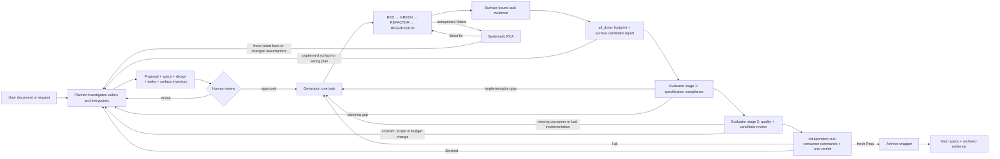

# Change workflow

<!-- autoai:workflow-binding:v1
{"role":"workflow-documentation","facts":["schema-upgrade-v2-explicit","schema-upgrade-v3-explicit","project-profile-command-ids","single-evaluator-verdict"]}
-->

quick_brief: Plan every product surface and real consumer in OpenSpec, bind Generator and Evaluator commands to it, reject unmatched candidates, and archive only a fresh unified Pass.



## Product-surface closure

Every added, modified, deprecated or removed production surface must form this closed chain:

```text
approved requirement -> task -> producer -> real consumer/entrypoint
                    -> Generator closing evidence -> independent Evaluator command
                    -> observable result
```

The seven surface kinds and their minimum consumers are:

| kind | required consumer | minimum proof |
|---|---|---|
| `internal_api` | `production_caller` | A production path invokes it through a real product entrypoint; a unit test calling it directly does not count. |
| `external_api` | `representative_external` | A representative downstream consumer uses installed/exported artifacts and compiles, links and, where applicable, runs. |
| `callback_or_plugin` | `registration_dispatch` | Both registration and an actual dispatch that reaches the implementation. |
| `cli` | `real_entrypoint` | The real executable, with observable arguments, output, exit code or state change. |
| `configuration` | `real_entrypoint` | A real process reads the value and changes observable behavior; parser-only tests are insufficient. |
| `protocol_or_persistence` | `producer_consumer_pair` | A real producer/consumer or compatibility path, not one-sided serialization alone. |
| `build_or_install` | `downstream_build` | A downstream configure/build/link and any necessary runtime check. |

“Might be useful later” is not a consumer. Delete such an interface or return to Planner. File-local helpers remain implementation details, but every changed production path/candidate must still receive an Evaluator disposition.

## Integration Completeness v1

Planner puts exactly one closed block in `design.md`. `reviewed_inventory` is the portable default. Choose `clang_ast` only by explicit design decision, with a safe repository-relative `compile_commands_path`, complete translation-unit coverage and compatible Clang tools. AST only improves candidate discovery; it never proves a consumer or runtime behavior.

````markdown
<!-- autoai:integration-completeness:v1 -->
```json
{
  "schema_version": 1,
  "discovery": {
    "mode": "reviewed_inventory",
    "compile_commands_path": null
  },
  "surfaces": [
    {
      "id": "surface-health-refresh",
      "kind": "internal_api",
      "name": "health::Service::refresh()",
      "change_kind": "added",
      "contract_impact": "compatible",
      "compatibility": null,
      "producer_paths": ["include/health/service.hpp", "src/health/service.cpp"],
      "consumer_kind": "production_caller",
      "consumer_paths": ["src/health/daemon.cpp"],
      "entrypoint": "health daemon refresh cycle",
      "evidence_contracts": [
        {
          "probe_id": "probe-health-refresh-test-current",
          "kind": "test",
          "role": "current",
          "argv": ["ctest", "--test-dir", "build", "-R", "health_refresh", "--output-on-failure"],
          "expected_exit_codes": [0],
          "output_contains": "100% tests passed"
        },
        {
          "probe_id": "probe-health-refresh-behavior-current",
          "kind": "behavior",
          "role": "current",
          "argv": ["build/bin/health-daemon", "--refresh-once"],
          "expected_exit_codes": [0],
          "output_contains": "health-refresh-ok"
        }
      ],
      "requirement_refs": [
        {
          "spec_path": "specs/health/spec.md",
          "operation": "ADDED",
          "requirement": "Refresh running health state",
          "scenarios": ["Daemon triggers refresh"]
        }
      ],
      "task_ids": ["1.2"],
      "verify_kinds": ["test", "behavior"],
      "task_obligations": [
        {
          "task_id": "1.2",
          "verify_kinds": ["test", "behavior"],
          "evidence_roles": ["current"]
        }
      ],
      "expected_observation": "The running daemon invokes refresh and publishes the new state.",
      "symbol_identities": null
    }
  ]
}
```
<!-- /autoai:integration-completeness:v1 -->
````

`id` starts with `surface-`. Requirement references must exactly match a delta requirement/scenario; task IDs must exactly match leaf tasks and their `Covers` edges. Each task obligation uses only Verify kinds declared by that task. Across a surface, obligations must exactly cover the Cartesian product of top-level Verify kinds and required roles. Use an explicitly reviewed empty `surfaces` array only when no production surface changes; later production candidates still force review.

`evidence_contracts` contains exactly one approved probe for every surface Verify-kind/required-role pair. `probe_id` is globally unique; `argv` and canonical shell exit codes are exact, not patterns; `output_contains` is a non-empty observable marker. Credential-bearing argv is forbidden. A `build_or_install` surface declares the closed boolean `runnable_artifact` field and always needs a downstream `build` probe; when the field is true, it also needs an executable `test`/`behavior` probe. Other surface kinds must not carry that field. The plan therefore authorizes a repeatable consumer experiment, not an arbitrary command that merely exits successfully.

`producer_paths`, `consumer_paths`, compatibility paths, focused RED tests and evidence argv must not point into `.ai-harness/logs/verification-workspaces`. Keep a consumer/test in the repository only when it is approved long-term regression or compatibility coverage. For a one-off C++ consumer, approve an exact command whose durable driver is invoked through `scripts/verification_workspace.sh run <change> -- ...`; the wrapper provides `AUTOAI_VERIFY_TMPDIR`, starts empty and removes generated sources, binaries and output when the synchronous driver returns. A killed wrapper or detached background writer may leave crash residue, which the next lifecycle gate must clean or reject.

## 完整工作流实例：http-request-latency-monitor

> 以下以实际完成的 change `http-request-latency-monitor`（归档于 `openspec/changes/archive/2026-08-03-http-request-latency-monitor/`）为例，
> 展示从创建到归档的完整工作流流程。该 change 新增了一个 eBPF 程序监控 HTTP 请求级延迟（TTFB），包含 3 个 task。

### 规划阶段（Planner 角色）

**Step 1: 创建 change**
```bash
bash scripts/change_new.sh http-request-latency-monitor --switch
```
说明：创建变更目录 `openspec/changes/http-request-latency-monitor/`，包含 `design.md` 和 `harness/` 子目录。`--switch` 表示将其设为当前活动 change。

**Step 2: 编写规划文档**
- `proposal.md`：说明 Why（为什么需要 HTTP 延迟监控——区分应用慢 vs 网络慢）和 What（新增 eBPF 探针、用户态监控器、Makefile 集成）
- `design.md`：架构设计（内核态 eBPF 探针流程 → BPF Map → 用户态读取）、变更文件清单、BPF 数据结构设计、HTTP 首部检测策略。**注意**：如果 surface 使用 `--project-command` 记录证据，`evidence_contracts` 的 `argv` 必须写包装器形式 `["scripts/project_command.sh","build-server","--change","http-request-latency-monitor","--json"]`
- `specs/weaknet-server/spec.md`：定义 ADDED 需求（`HTTP请求延迟监控` 和 `HTTP延迟集成`），每个需求下有一个或多个 Scenario（`eBPF HTTP延迟探针实现`、`用户态监控接口`、`构建更新`）。**注意**：每个 Scenario 名称必须唯一、后续 task Covers 引用的场景名必须与 spec 完全一致（含空格）。
- `tasks.md`：3 个 task，每个有 Covers 引用 spec 中的 requirement+scenario，Verify 声明为 `build`。task 编号必须唯一。

**Step 3: 校验并冻结规划**
```bash
bash scripts/openspec_cli.sh validate http-request-latency-monitor --strict
bash scripts/evaluator_check.sh --plan
bash scripts/snapshot_update.sh --freeze-planning-baseline
```
说明：`validate --strict` 检查 spec 格式（requirement 必须含 MUST/SHALL、scenario 有 WHEN/THEN）。`--plan` 检查 plan 完整性。`freeze-planning-baseline` 锁定 planning_fingerprint 和 tdd_policy_sha256。**冻结后不能再改 design.md**，否则已记录 evidence 会因 fingerprint 变化而作废。

### 实现阶段（Generator 角色）

**Step 4: 冻结实现基线并改代码**
```bash
bash scripts/snapshot_update.sh --freeze-implementation-base
# 现在才能改代码！改完后提交
```
说明：**必须先 freeze 再改代码**。如果反序（先改代码再 freeze），diff 为空、footprint 无变化、`--path` 引用会不匹配。

**Step 5: 记录 evidence 并完成任务**
```bash
# 查看 footprint 状态
bash scripts/change_footprint.sh http-request-latency-monitor --json

# 记录 build 证据（由于 eBPF 运行时需 ARM64 真机，用 unavailable_hardware 例外走 ALTERNATIVE）
bash scripts/task_verify.sh 1 --phase alternative --kind build \
  --exception-id exc-no-target-hardware --path server/src/http_latency.bpf.c \
  --project-command build-server

# 完成任务
bash scripts/task_verify.sh --complete 1

# 对 task 2 和 task 3 重复相同操作
bash scripts/task_verify.sh 2 --phase alternative --kind build ...
bash scripts/task_verify.sh --complete 2
bash scripts/task_verify.sh 3 --phase alternative --kind build ...
bash scripts/task_verify.sh --complete 3
```
说明：`--project-command build-server` 会执行 `scripts/project_command.sh build-server --change http-request-latency-monitor --json`（包装器形式），evidence 记录的是这个包装器 argv。task 的 `--path` 必须在 exception 允许的路径范围内。

**Step 6: 刷新集成报告**
```bash
bash scripts/integration_surface_check.sh http-request-latency-monitor --refresh --json
```
说明：`--refresh` 从冻结的 plan、implementation-base diff 和 footprint 推导出 `integration-surface-report.json`。

### 评估阶段（Evaluator 角色）

**Step 7: 生成 evaluation 并完成评估**
```bash
# 开始 evaluation
bash scripts/evaluator_check.sh --begin

# 运行独立验证命令（用 --project-command，与 Generator 证据独立）
bash scripts/evaluator_check.sh --run --kind build --project-command build-server

# 生成 evaluation.json 骨架并填充
bash scripts/evaluation_template.sh http-request-latency-monitor
# 手工或 evaluation_fix.sh 填充 TODO 字段

# 预检 + 完成
bash scripts/pre_finish.sh http-request-latency-monitor
bash scripts/evaluator_check.sh --finish
```
说明：Evaluator 是独立于 Generator 的验证，不能复用 Generator 的命令输出。`--finish` 会校验所有 fingerprints、evidence 完整性、integration completeness。最终 verdict 为 Pass 后才能归档。

### 归档阶段

**Step 8: 归档**
```bash
bash scripts/change_archive.sh http-request-latency-monitor
```
说明：归档将 change 目录移到 `openspec/changes/archive/`，主 spec 更新，active selector 清空。**归档后必须全量提交**，确保工作区干净。

### 关键注意事项

- **surface 设计**：纯编译期变更的 surface（如新增 eBPF 探针，运行时需 ARM64 真机）应使用 `"kind":"build_or_install"` + `"runnable_artifact":false`，避免 `--plan-check` 报 `surface needs test or behavior evidence`。
- **probe argv 格式**：使用 `--project-command` 时，`evidence_contracts` 的 `argv` 必须写包装器形式 `["scripts/project_command.sh","<command-id>","--change","<change>","--json"]`，不能写裸命令如 `["make","-C","server"]`。
- **eBPF 编译**：必须通过 ARM64 Docker 容器 `weaknet-arm64-dev` 编译，禁止在 x86 开发机上直接 `make`。
- **design.md 不可修改**：记录 evidence 后不能再改 design.md 的任何字段（含 exception task_ids、classification 路径、thresholds），否则指纹变化会导致所有 evidence 作废。
- **代码先存在时不追认**：若功能代码已写好并提交，不要创建 change 试图"追认"它。要么直接提交为普通 commit，要么 `git revert` 后走完整流程。

`change_kind` is `added`, `modified`, `deprecated` or `removed`. `contract_impact` is `compatible`, `breaking`, `deprecation` or `removal`; the last two pair only with deprecated/removed. Non-compatible surfaces carry the closed compatibility fields `old_consumer_paths`, `replacement_consumer_paths`, `replacement_policy`, `expected_old_result`, `migration_path` and `exit_condition`. Set `replacement_policy` to `required` whenever a replacement path exists. Only a removal whose referenced requirements are all `REMOVED` may use `requirement_approved_none`, and then the replacement path array must be empty. Evidence roles are `current`, `old_consumer`, `replacement_consumer` and `absence_probe`: compatible needs current; breaking/deprecation need old and replacement; removal needs old and absence, plus replacement when planned.

Run `scripts/integration_surface_check.sh <change> --plan-check --json` before human approval and planning freeze. A valid plan is intent, not proof that paths are implemented.

## Generator closure

Generator handles one verifiable task at a time. Before coding, compare the requested change with the frozen surface inventory. If implementation needs a new interface, entrypoint, consumer, dependency, target, compatibility behavior or evidence obligation, stop and return to Planner; do not add it first and document it later.

A behavior task records RED as `ExpectedFailure`, implements the smallest GREEN against the same immutable focused test, then records declared REGRESSION evidence. Closing commands for an integrated task use repeatable bindings:

```text
scripts/task_verify.sh <task-id> --phase regression --cycle <id> --kind <kind> \
  --surface <surface-id> \
  --surface-role <surface-id>=old_consumer \
  ... --project-command <command-id>
```

Use `--project-command <command-id>` for a reviewed Project Profile operation, or `-- <argv...>` for an approved durable repository driver that is not a Profile command; the two forms are mutually exclusive. The command-ID form is recorded and matched as the normalized argv `scripts/project_command.sh <command-id> --change <active-change> --json`, so the Integration probe must declare that exact wrapper argv. Generator must not run `project_command.sh` first and then submit a second command to the evidence wrapper.

`--surface` means role `current`. Bind only obligations assigned to this task and command kind. A surface-bound REGRESSION, or an approved non-environment ALTERNATIVE that closes an obligation, must match the planned probe's argv and expected exit codes byte-for-byte and its captured output must contain the planned marker; the ledger records the derived `surface_probe_bindings`. Hardware/external-service provisional ALTERNATIVE records the assigned surface roles and blocking exception but no fake closing probe. RED/GREEN, grep, static inspection, compile-only checks, self-reported success, or an unrelated successful command cannot close a consumer obligation. `scripts/task_verify.sh --complete <task-id>` is the only task-checkbox transition and rechecks current planning, source, TDD and surface evidence.

Before adding a test or consumer fixture, decide whether it has durable regression/compatibility value. Durable assets remain in the project and count in the footprint. One-off experiments use the managed workspace and are cleaned after every command; `--complete`, final report refresh, Evaluation finish and archive all fail closed unless that workspace is empty.

After every task is complete, run `scripts/integration_surface_check.sh <change> --refresh --json`. It derives `harness/integration-surface-report.json` from the frozen plan, implementation-base diff, footprint and optional AST discovery. It does not edit OpenSpec. A later `--check` must match exact current bytes; stale evidence is never silently refreshed by Evaluation or archive.

## Independent review and verdict

Evaluator is a separate attempt. Before `--begin`, read the actual committed, staged, unstaged, untracked and dirty-gitlink state plus `integration-surface-report.json`. Review every path/structural/AST candidate, including candidates not mapped to a planned surface. Independently execute real-consumer commands with the same `--surface` or `--surface-role` syntax on `evaluator_check.sh --run`.

Evaluator must reject an accidental one-off probe in the Git review input and any closing command that depends on a temporary path scheduled for deletion. Independent one-off probes run through a fresh managed workspace. Archived evidence keeps exact argv, exit code, output digest/summary and assessment, not temporary source or binaries.

Every candidate gets exactly one disposition and every planned surface gets exactly one assessment. A missing real consumer, unrelated evidence or missing evidence role is `Fail` and returns to Generator. An unplanned candidate or wrong requirement/task/classification/scope is `Blocked` and returns to Planner. An unavailable required environment is `Blocked`; it cannot be downgraded to residual risk. `Fail` has priority over `Blocked`, and the unified Evaluation remains the only verdict.

When planning changes after implementation starts, affected tasks remain unchecked. Planner revises artifacts, runs strict validation and `--plan-check`, obtains renewed human approval, then uses `snapshot_update.sh --refresh-planning-baseline`. This never advances the frozen implementation base. An old v1/v2 evidence family is not implicitly upgraded; only an eligible evidence-empty change may use `task_verify.sh --upgrade-v3 <change>`.

Fresh context is optional for high-risk tasks and independent review. Generate it with `change_status.sh --agent-context investigator|reviewer` or `--agent-context generator --task <id>`. The same worktree always has one writer; parallel agents may only perform read-only investigation or review. The optional linked-worktree pilot is explicitly leased through `harness_lock.sh isolation-*`; it never creates, commits, merges, pushes, stashes, resets, prunes or deletes Git state. Worktree creation and Git integration/cleanup remain user-owned.

## Project capability control and derived navigation

`.ai-harness/project-profile.json` is the reviewed description of modules, adapters, path roles, build targets/graph/distribution surfaces, stable command IDs and optional `capability_status` declarations. It is not a specification or state store. A command-backed capability is available by declaration and then subject to runtime checks; a commandless capability may be `unavailable`, `not-applicable` or `needs-approval`, while omission is reported as `absent`. Run `scripts/harness_doctor.sh --json` for read-only control-plane, capability and active-evidence diagnostics. Execute a reviewed operation through the evidence wrapper's `--project-command` option; the wrapper invokes `scripts/project_command.sh` and retains the canonical environment envelope under the active change. Direct execution does not create task or Evaluation evidence.

The following navigation and governance views are advisory or policy inputs, never a second source of truth:

- `scripts/project_index.sh --refresh --json` builds a Profile/source/toolchain-contract-bound project index; `--check` rejects stale bytes.
- `scripts/context_slice.sh <change> --refresh --json` orders P0 through P3 reading candidates under an explicit heuristic token budget. It never limits Evaluator diff or untracked-file review.
- `scripts/campaign.sh <campaign> --status --json` validates a read-only cross-change DAG and may suggest `--next-ready`; it never creates or selects a change.
- `scripts/event_audit.sh <change> --refresh --json` rebuilds a hash-chained projection from retained evidence.
- `scripts/organization_policy.sh --check --json` validates optional local/CI/release execution restrictions; policy can deny a Profile command but cannot create one.

Legacy evidence stays in its declared schema. An eligible evidence-empty change may explicitly run `scripts/task_verify.sh --upgrade-v2 <change>` and then `scripts/task_verify.sh --upgrade-v3 <change>`; normal reruns and `--force` never perform an implicit evidence migration.
