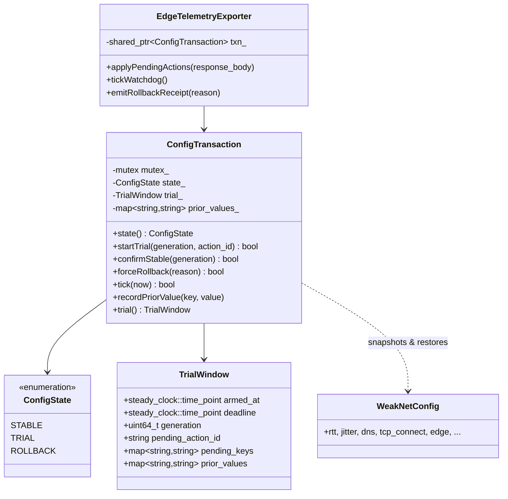
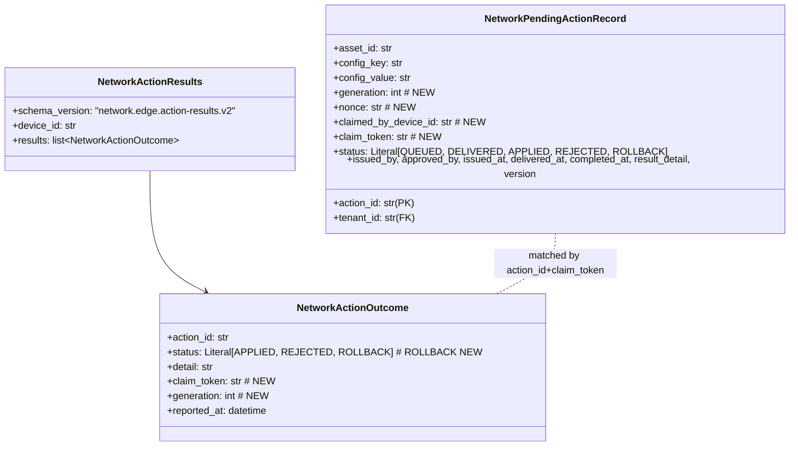
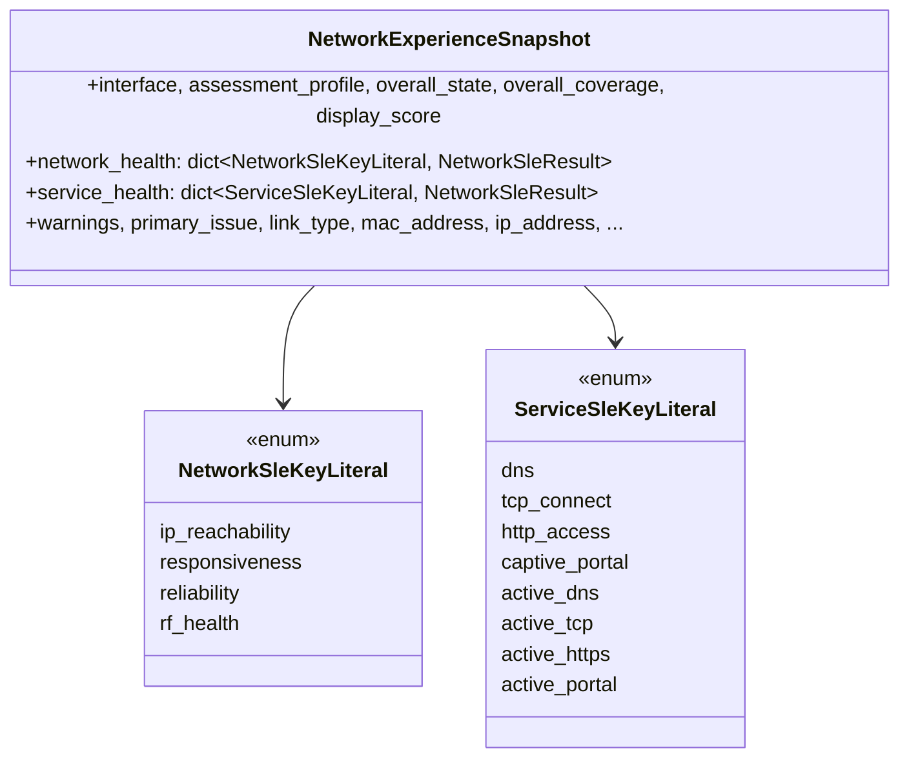

# 演进一/演进二 实施计划 — 因果防线契约化 + 边端配置事务看门狗

> 由 Plan 代理产出并经用户确认。本文档是 Planner 阶段的工作底稿，进入 OpenSpec 流程后由 Planner 角色转为正式 proposal/design/specs。

## 决策记录（用户已确认）

| 问题 | 决定 |
|---|---|
| ROLLBACK 形态 | **瞬态** — 恢复即自动回 STABLE，发回执告警 |
| `prior_values_` 持久化 | **写盘**（data_dir），崩溃后自动恢复 |
| 动作 `generation` | **独立 action 序列**，与 `config_generation`（驱动快照失效）解耦 |
| v1 action-results 兼容 | **双栈一个 release**，下版本淘汰 |

---

## 0. 拆解为两个 OpenSpec change

两项演进不变量不同、评审人不同、验证面不同、回滚边界不应跨 C++/Python，必须拆开：

- **Change A `edge-telemetry-contract-firewall`** — copilot 因果链修复 + 契约白名单 + 跨语言 CI 校验工具
- **Change B `edge-config-transaction-watchdog`** — 三态边端配置事务 + 180s 看门狗 + 云端下发元数据强化

推荐顺序：**A 先 B 后**。B 在工具层可复用 A 的 `verify_telemetry_contract.py` 校验 `pending_actions` envelope，但仅是工具依赖而非行为依赖，反向顺序亦可。

两个 change 都严守铁律 `freeze-implementation-base`：
```
1. change_new.sh <name> --switch
2. 写 proposal/design/specs/tasks（本步在 freeze 之外）
3. openspec_cli.sh validate --strict
4. evaluator_check.sh --plan
5. snapshot_update.sh --freeze-planning-baseline
6. snapshot_update.sh --freeze-implementation-base   ← 铁律闸
7. 改代码 + task_verify.sh 记录
8. evaluator + archive
```

---

## 1. 已落位的文件路径

| 组件 | 路径 |
|---|---|
| Copilot 因果链 | `Large-Model-Application/src/industrial_ops_agent/network_assurance/copilot.py` |
| 契约 (Python) | `Large-Model-Application/src/industrial_ops_agent/network_assurance/contracts.py` |
| Assurance 服务 (claim/ack) | `Large-Model-Application/src/industrial_ops_agent/network_assurance/service.py` |
| Assurance 签名 | `Large-Model-Application/src/industrial_ops_agent/network_assurance/signing.py` |
| 路由 | `Large-Model-Application/src/industrial_ops_agent/api/routes/network_assurance.py` |
| 持久化模型 | `Large-Model-Application/src/industrial_ops_agent/persistence/models.py`（5816-5960） |
| 边端 exporter | `server/src/edge_telemetry_exporter.cpp` + `server/include/edge_telemetry_exporter.hpp` |
| 边端 serializer | `server/include/assurance/edge_telemetry_serializer.hpp` |
| 评估器顺序 | `server/include/assurance/overall_policy.hpp` |
| WeakNet 运行时配置 | `server/src/weaknet_config.cpp` + `server/include/weaknet_config.hpp` |
| 快照 / generation | `server/include/assessment_snapshot.hpp`、`server/include/server.hpp`（`config_generation`） |
| 网络 epoch | `server/include/network_epoch_store.hpp` |
| Exporter 测试 | `server/test/unit/test_edge_telemetry_exporter_gtest.cpp` |
| Config 测试 | `server/test/unit/test_weaknet_config_gtest.cpp` |
| 板端契约验证 | `tools/verify_v1_contract.sh` |
| CI | `.github/workflows/ci.yml`、`Large-Model-Application/.github/workflows/ci.yml` |
| OpenSpec | `openspec/changes/`（当前 `ai_snapshot.json` 处于 `idle` / `change-aborted`） |

---

## 2. Change A — `edge-telemetry-contract-firewall`

### A1. `copilot.py` — 因果链修复

| 当前读错的位置 | 序列化器实际写的 key | 修复后 copilot 应读 |
|---|---|---|
| `network.get("reachability")` (`copilot.py:211`) | `"ip_reachability"` 在 `network_health` 下 | `network["ip_reachability"]` |
| `network.get("dns_resolution")` (`copilot.py:224`) | `"dns"` 在 `service_health`（被动）+ `"active_dns"`（capability） | `service["dns"]` 优先；`capability_level_negative` 为真时升级到 `service["active_dns"]` |
| `network.get("transport")` (`copilot.py:235`) | `"tcp_connect"` 在 `service_health`（被动、非否决）+ `"active_tcp"`（capability） | `service["tcp_connect"]` 仅建议性；`service["active_tcp"]` 才能驱动 BAD |
| *缺* | `"http_access"` + `"active_https"` | `service["http_access"]`（建议性）；`service["active_https"]`（capability） |
| *缺* | `"captive_portal"` + `"active_portal"` | `service["captive_port"]` / `service["active_portal"]`，作为因果链尾部的 portal 步骤 |

具体改造：
- `_sle_states` 返回 `dict[str, dict[str, Any]]`，保留 `state` + `capability_level_negative` + `reason` + `applicability`（不再只取 `state`）。
- `_causal_chain` 拆分两段：`core_network`（`ip_reachability` / `responsiveness` / `reliability` / `rf_health`）与 `service`（`dns` / `tcp_connect` / `http_access` / `captive_portal` / `active_*`）。
- R1 仅在 `core_network["ip_reachability"] == "BAD"` 时触发。
- DNS 步骤先读 `service["dns"]`；当 `capability_level_negative` 为真时升级到 `service["active_dns"]`，并区分不同的 `explanation`。
- 传输层步骤 `service["tcp_connect"]` 标注「非否决」；只有 `service["active_tcp"]` 才能驱动 BAD。
- 因果链尾部追加 `captive_portal` / `active_portal` 步骤，门户劫持不再被静默丢弃。
- 导出 `NON_BLOCKING_SLE_KEYS` frozenset，供 CI 校验工具读取。

### A2. `contracts.py` — 契约白名单

引入封闭 Literal：

```python
NetworkSleKeyLiteral = Literal[
    "ip_reachability", "responsiveness", "reliability", "rf_health",
]
ServiceSleKeyLiteral = Literal[
    "dns", "tcp_connect", "http_access", "captive_portal",
    "active_dns", "active_tcp", "active_https", "active_portal",
]
```

采用 **方案 A2a（推荐，迁移成本最低）**：保留 `dict[str, NetworkSleResult]` 形态，新增 `field_validator` 拒绝白名单外的键：

```python
NETWORK_SLE_KEYS: Final[frozenset[str]] = frozenset({
    "ip_reachability", "responsiveness", "reliability", "rf_health",
})
SERVICE_SLE_KEYS: Final[frozenset[str]] = frozenset({
    "dns", "tcp_connect", "http_access", "captive_portal",
    "active_dns", "active_tcp", "active_https", "active_portal",
})

@field_validator("network_health", "service_health", mode="before")
@classmethod
def _check_sle_keys(cls, v: Any, info: ValidationInfo) -> Any:
    if not isinstance(v, dict):
        return v
    allowed = NETWORK_SLE_KEYS if info.field_name == "network_health" else SERVICE_SLE_KEYS
    unknown = set(v) - allowed
    if unknown:
        raise ValueError(f"{info.field_name}: unknown SLE keys {sorted(unknown)}")
    return v
```

**消费者迁移**：`_experience_payload` / copilot / `latest_snapshot_json` 全部走 dict 形态，无需改代码；只有非法载荷在 ingest 阶段更早失败。

### A3. `tools/verify_telemetry_contract.py`（新文件）

三步合一的 CLI：

1. **C++ source-of-truth 提取** — 解析 `edge_telemetry_serializer.hpp` 中所有 `dump_sle("<key>", ...)`，收集 `network_health` / `service_health` 实际会写出的 key 集合及顶层快照字段。
2. **Python 反序列化回放** — 用提取到的 key 构造一份合法的 `NetworkExperienceSnapshot` payload，调用 `model_validate` 验证契约接受。
3. **因果链覆盖率校验** — 对每个被发射的 key，断言 copilot 的 `_causal_chain` 要么消费它（出现在 `.get("...")`），要么被显式分类为非否决（在 `NON_BLOCKING_SLE_KEYS` 中）。两者都不满足 → fail。

可选加强：把 `service.py` 中 `_claim_pending_actions` 的响应 envelope 与 `pending_actions` schema 交叉校验。

### A4. `.github/workflows/ci.yml`（root）

新增 contract-check 步骤：

```yaml
- name: Edge telemetry contract cross-language check
  run: |
    sudo apt-get install -y -qq python3 python3-pip
    python3 -m pip install --quiet pydantic
    python3 tools/verify_telemetry_contract.py --strict
```

或拆成独立 `contract-check` job 与 `lint-and-check` 并行，避免契约回归掩盖卫生检查失败。

### A5. `Large-Model-Application/.github/workflows/ci.yml`

在 `quality` job `uv sync --frozen --extra dev` 之后：

```yaml
- name: Edge telemetry contract verifier
  run: .venv/bin/python ../tools/verify_telemetry_contract.py --strict
```

### A6. `service.py`

本 change **不改代码**（Change B 才动 `_claim_pending_actions` / `queue_action`）。

### A7. 新增 `Large-Model-Application/tests/test_network_copilot.py`

覆盖：

- `ip_reachability=BAD` → 一步 R1 链路，后续所有步骤被抑制
- `dns=BAD` + `capability_level_negative=true` → 主机解析失败步（非被动失败）
- `active_dns=BAD` → 受控目标失败步
- `tcp_connect=BAD` 不能升级为 Internet-BAD；`active_tcp=BAD` 可以
- `captive_portal=BAD` → portal 步
- 缺失可选 `active_*` 键 → 不报错
- 出现未知 SLE key → 契约层失败（验证 A2）

### A8. `server/test/unit/test_edge_telemetry_exporter_gtest.cpp`（扩展）

加入 golden key 列表断言：

- `network_health` 4 个键：`ip_reachability` / `responsiveness` / `reliability` / `rf_health`
- `service_health` 8 个键：`dns` / `tcp_connect` / `http_access` / `captive_portal` / `active_dns` / `active_tcp` / `active_https` / `active_portal`

字符串匹配即可，权威校验在 Python 端；这里是本地防线，防止 `dump_sle` 键名笔误流入 CI。

---

## 3. Change B — `edge-config-transaction-watchdog`

### B1. `server/include/weaknet_config.hpp`

新增 `ConfigTransaction`（与 `WeakNetConfig` 同级）：

```cpp
enum class ConfigState : uint8_t { STABLE, TRIAL, ROLLBACK };

struct TrialWindow {
    std::chrono::steady_clock::time_point deadline;
    std::chrono::steady_clock::time_point armed_at;
    uint64_t generation{0};
    std::string pending_action_id;
    std::map<std::string, std::string> pending_keys;
    std::map<std::string, std::string> prior_values;
};

class ConfigTransaction {
public:
    ConfigState state() const;
    bool startTrial(uint64_t generation, std::string action_id, std::string* error);
    bool confirmStable(uint64_t generation, std::string* error);
    bool forceRollback(std::string reason);
    bool tick(std::chrono::steady_clock::time_point now);
    const TrialWindow& trial() const;
private:
    mutable std::mutex mutex_;
    ConfigState state_{ConfigState::STABLE};
    TrialWindow trial_{};
    std::map<std::string, std::string> prior_values_;
};
```

**为什么** — 现有 `setMonitorParam` 无状态，无法回答「这个字段在 trial 之前是什么」。回滚必须在 trial 启动时快照 prior_values。

### B2. `server/src/weaknet_config.cpp`

- 实现 `ConfigTransaction` 全部方法。
- 新增 `snapshotMonitorParam(const WeakNetConfig&, const std::string& key, std::string* value_out)`，返回指定 key 的当前序列化形式。
- `setMonitorParam` 与 transaction 协作：`state==TRIAL` 时写入 `trial_.pending_keys`，prior 值保存到 `prior_values_`，直到 `confirmStable` 或 `forceRollback` 才清空。

### B3. `edge_telemetry_exporter.{hpp,cpp}` — 应用侧接入

- `EdgeTelemetryExporter` 持有 `std::shared_ptr<ConfigTransaction>`（与 `ServerContext` 共享所有权）。
- `applyPendingActions` 流程改为：
  1. action 的 `key` 落在 trialable 白名单 → 若 `state!=TRIAL` 先 `txn->startTrial(generation, action_id, ...)`。
  2. 应用参数。
  3. 把 `pending_action_id` / `key` / `value` 记入 `trial_`。
  4. 看门狗 `deadline = now + 180s`。
- `run()` 主循环（或独立 watchdog 线程，见风险点 6）调 `tickWatchdog()`；`state==TRIAL && now > deadline` 时根据健康评估走 `confirmStable` 或 `forceRollback`。
- 新增 `emitRollbackReceipt(const std::string& reason)` — 入队 `EdgeActionResultRecord{status="ROLLBACK", detail=reason, action_id="watchdog-"+uuid}`。

**Trialable 白名单（初版）**：`rtt.interval_ms`、`rtt.timeout_ms`、`rtt.target`、`jitter.interval_ms`、`dns.interval_ms`、`tcp_connect.interval_ms`、`edge.interval_ms`、`edge.timeout_ms`。
**非 trialable**（直通道）：`edge.url` / `edge.token` / `edge.device_id` / `edge.private_key_path` / `edge.key_id` / `edge.tenant` / `*.bpf_obj` / `active_probe.targets` / `active_probe.portal_*` —— 这些若 trial 中途回滚可能直接断链。
**拒绝写入**：`edge.enabled`、`dns.assessment_profile`、`server.*` —— 必须改 YAML。

### B4. `server/src/server.cpp`

- `loadWeakNetConfig` 之后、`start_server` 之前构造 `std::shared_ptr<ConfigTransaction>` 放入 `ServerContext`。
- 同一指针传给 `EdgeTelemetryExporter` 构造器。

### B5. `server/include/server.hpp`

`ServerContext` 新增：

```cpp
std::shared_ptr<weaknet::ConfigTransaction> config_txn;
```

并注明：`config_generation` 仅能通过 `config_txn->startTrial` / `confirmStable` 推进，禁止裸写。

### B6. `server/src/dbus_service.cpp`

约 `dbus_service.cpp:1301` 的 `SetMonitorParam` 路径改为 `txn->applyOrReject(cfg, key, value, error)`；`state==TRIAL` 时返回 `trial_in_progress` D-Bus 错误，防止运维 CLI 中途踩掉云端动作。

### B7. `persistence/models.py`

`NetworkPendingActionRecord` 扩展：

```python
generation: Mapped[int] = mapped_column(BigInteger, nullable=False, default=0)
nonce: Mapped[str] = mapped_column(String(64), nullable=False, default="")
claimed_by_device_id: Mapped[str | None] = mapped_column(String(128), nullable=True)
claim_token: Mapped[str | None] = mapped_column(String(128), nullable=True)
```

新增 `Index("ix_network_pending_actions_nonce", "tenant_id", "nonce")` 用于重放检测；已有 `ix_network_pending_actions_queue` 保留。

### B8. `service.py` — claim/ack 加固

1. `queue_action` — `nonce = uuid4().hex`；`generation = (per-asset action sequence) + 1`（独立序列，不复用 `config_generation`，见决策 Q3）。
2. `_claim_pending_actions` —
   - 先 `SELECT ... FOR UPDATE` 锁 asset 行（悲观锁）。
   - 每个 QUEUED → `DELIVERED`，写入 `claimed_by_device_id`、`claim_token = uuid4().hex`、`nonce`/`generation`。
   - 响应中携带 `claim_token`，设备回执时回显。
3. `record_action_results` — 要求设备回 `claim_token`；与持久化值不匹配视为重放拒绝；状态更新须 `tenant_id` + `claim_token` 双匹配。

### B9. `contracts.py` — action-results v2

`NetworkActionOutcome`（行 261）扩展：

```python
claim_token: str = Field(min_length=1, max_length=128)
generation: int = Field(ge=0)
```

`NETWORK_ACTION_RESULTS_SCHEMA_VERSION` 升至 `"network.edge.action-results.v2"`；v1 仍接受（`claim_token=""` 视为兼容模式），符合决策 Q4。

`_claim_pending_actions` 下发 payload 扩为 `{action_id, key, value, generation, nonce}`。

### B10. `edge_telemetry_exporter.cpp` — 解析扩展字段

`PendingAction`（行 160）加 `generation: uint64` 与 `nonce: string`；`parsePendingActions` 抽取。
拒绝 `generation <= config_generation.load()`（stale）→ REJECTED + `stale_generation` reason。

### B11. `edge_telemetry_exporter.cpp` — 回执带上 claim_token

`EdgeActionResultRecord` 上报体加 `claim_token` + `generation`，服务端据以匹配 claim。

### B12. `service.py` — 接受 ROLLBACK 回执

`NetworkActionOutcome.status` Literal 扩为 `["APPLIED", "REJECTED", "ROLLBACK"]`；`record_action_results` 持久化时识别新状态。

### B13. 测试

- `test_weaknet_config_gtest.cpp` — `ConfigTransaction`：STABLE→TRIAL 快照 prior；TRIAL→ROLLBACK 还原；TRIAL→STABLE `confirmStable`；`tick` deadline 触发。
- `test_edge_telemetry_exporter_gtest.cpp` — `pending_actions` 解析扩展字段；stale generation 拒绝。
- `Large-Model-Application/tests/test_network_assurance_service.py`（新）— `queue_action` nonce/generation；悲观锁 claim；claim_token 匹配/不匹配；跨租户隔离；ROLLBACK 状态入库。

---

## 4. 数据 / 状态模型图

### 4.1 C++ `ConfigTransaction`



### 4.2 Python `NetworkPendingActionRecord` v2



### 4.3 SLE 白名单



---

## 5. STABLE / TRIAL / ROLLBACK 状态迁移表

| 从 | 到 | 触发 | 守卫 | 动作 | 副作用 |
|---|---|---|---|---|---|
| STABLE | TRIAL | `pending_actions` 到达，key 在 trialable 白名单 | `state==STABLE` ∧ `generation > config_generation` | 快照 prior → 应用 → `deadline=now+180s` → `config_generation=generation` → `state=TRIAL` | 日志 `config_trial_started` |
| STABLE | STABLE | 非 trialable key 或 D-Bus 直写 | 白名单许可 ∧ `state==STABLE` | 应用参数，generation 不变 | 现状路径 |
| TRIAL | TRIAL | 新 trialable action 到达，generation 更新 | `state==TRIAL` ∧ `generation > trial_.generation` | prior_values 保留初值，应用新值，**重新武装** deadline | 日志 `config_trial_extended` |
| TRIAL | TRIAL | 新 action 但 `generation <= trial_.generation` | — | 拒绝 `stale_generation`，回执 REJECTED | 告警日志 |
| TRIAL | STABLE | `tick` 后 deadline 过 + 健康探针 OK | `now > deadline` ∧ `overall_state != BAD` ∧ `ip_reachability != BAD` | `state=STABLE`，清 `trial_`，发 APPLIED 回执 | `config_trial_confirmed` |
| TRIAL | ROLLBACK | `tick` 后 deadline 过 + 健康 BAD | `now > deadline` ∧ (`overall_state==BAD` ∨ `ip_reachability==BAD`) | 还原 `prior_values_`，`state=ROLLBACK`（瞬态），随即 STABLE | ROLLBACK 回执入队 |
| TRIAL | ROLLBACK | `tick` 后 deadline 过 + 无可用快照 | `now > deadline` ∧ no current snapshot | 同上（fail-safe） | 同上 |
| TRIAL | ROLLBACK | 手动 `forceRollback(reason)`（D-Bus `config_txn.rollback`） | `state==TRIAL` | 同上 | 同上 |
| TRIAL | STABLE | 手动 `confirmStable(generation)`（D-Bus `config_txn.commit`） | `state==TRIAL` ∧ `generation == trial_.generation` | `state=STABLE`，清 `trial_` | `config_trial_committed` + APPLIED 回执 |
| ROLLBACK | STABLE | `prior_values_` 还原完成后自动（决策 Q1：瞬态） | 总是 | `state=STABLE`，清 `trial_`，发 ROLLBACK 回执 | 回执入队，遥测按旧参数恢复 |
| any | any | `stop()` / 析构 | — | `state==TRIAL` 时强制 `forceRollback("shutdown_in_trial")` | 回执可能发不出去，本地落盘 |

**注意**：ROLLBACK 按决策 Q1 是**瞬态**——restore → emit receipt → STABLE 在单次 `tick` 内完成。

---

## 6. 看门狗时序语义

| 问题 | 回答 |
|---|---|
| 何时起算 180s | 第一个 trialable key 被 `applyPendingActions` 应用时：`armed_at = now; deadline = now + 180s` |
| 何时重置 | (a) 更新的 trialable action 到达 → `deadline` 重置 `now + 180s`；(b) `confirmStable` → 清除；(c) `forceRollback` → restore 后清除 |
| 什么触发 ROLLBACK | `tick()` 返回真且 `state==TRIAL`。三种评估路径全部 → ROLLBACK：(i) deadline 过 + `overall_state==BAD`；(ii) deadline 过 + `ip_reachability==BAD`；(iii) deadline 过 + 无可用快照 |
| 快照 GOOD/DEGRADED/UNKNOWN 但可达 | TRIAL → STABLE（自动 commit）。看门狗是安全网，不是审批闸；180s 后设备仍健康则视 trial 通过 |
| 进程在 TRIAL 中崩溃重启 | 内存态丢失。daemon 重启回到 STABLE + YAML 配置 —— 这本身就是 fail-safe，等价于 watchdog 回滚。**按决策 Q2**，另把 `prior_values_` 写到 `data_dir`；启动时若发现残留文件且无活跃 trial 标记，则还原并删除 |
| TRIAL 中收到非 trialable action | 拒绝 `trial_in_progress` —— 身份/安全键不能在 trial 中变更 |
| `config_generation` 回绕 / 重放 | `generation <= config_generation.load()` 拒绝，回执 `stale_generation` |
| 回执环缓冲溢出 | ROLLBACK 是普通 `EdgeActionResultRecord`，离线则滞留 `pending_action_results_`，下次上行重放 —— 与 APPLIED/REJECTED 同语义 |

---

## 7. CI 接入步骤

### root `.github/workflows/ci.yml` — `lint-and-check` job 内或并行新 job

```yaml
- name: Edge telemetry contract cross-language check
  run: |
    sudo apt-get install -y -qq python3 python3-pip
    python3 -m pip install --quiet pydantic
    python3 tools/verify_telemetry_contract.py --strict
```

### `Large-Model-Application/.github/workflows/ci.yml` — `quality` job

在 `uv sync --frozen --extra dev` 之后：

```yaml
- name: Edge telemetry contract verifier
  run: .venv/bin/python ../tools/verify_telemetry_contract.py --strict
```

### 失败形态示例

```
FAIL edge-telemetry-contract
  C++ emits 4 network SLEs, Python whitelist accepts 4 — OK
  C++ emits 8 service SLEs, Python whitelist accepts 8 — OK
  Python NetworkExperienceSnapshot rejects payload — OK
  FAIL causal coverage: key 'active_portal' is emitted by C++ but copilot's
       _causal_chain neither consumes it nor classifies it non-blocking.
       Add a branch in _causal_chain or an entry in NON_BLOCKING_SLE_KEYS.
```

### `verify_telemetry_contract.py` 伪代码

```python
def extract_cpp_keys():
    src = Path("server/include/assurance/edge_telemetry_serializer.hpp").read_text()
    network = re.findall(r'dump_sle\("([^"]+)",\s*exp\.(ip_reachability|responsiveness|reliability|rf_health)', src)
    service = re.findall(r'dump_sle\("([^"]+)",\s*exp\.(dns_service|tcp_connect|http_access|captive_portal|active_dns|active_tcp|active_https|active_portal)', src)
    return {k for k,_ in network}, {k for k,_ in service}

def check_deserialize(keys_net, keys_svc):
    payload = build_sample_snapshot(keys_net, keys_svc)
    NetworkExperienceSnapshot.model_validate(payload)

def check_causal_coverage(keys_net, keys_svc):
    copilot_src = Path(".../copilot.py").read_text()
    consumed = set(re.findall(r'\.get\("([^"]+)"\)', copilot_src))
    uncovered = (keys_net | keys_svc) - consumed - NON_BLOCKING_SLE_KEYS
    assert not uncovered, f"uncovered keys: {uncovered}"
```

---

## 8. 实施步骤（顺序敏感）

### Change A — `edge-telemetry-contract-firewall`

```
1.  change_new.sh edge-telemetry-contract-firewall --switch
2.  写 proposal/design/specs/tasks（wire schema 标 compatible —— 白名单非破坏）
3.  openspec_cli.sh validate edge-telemetry-contract-firewall --strict
4.  evaluator_check.sh --plan
5.  snapshot_update.sh --freeze-planning-baseline
6.  snapshot_update.sh --freeze-implementation-base      ← 铁律闸
7.  A1 改 copilot.py（_sle_states 携带 capability_level_negative；
    _causal_chain 按 ip_reachability/dns/tcp_connect/captive_portal/active_* 重写；
    导出 NON_BLOCKING_SLE_KEYS）
8.  A2 改 contracts.py（Literal + 白名单 validator）
9.  A3 新增 tools/verify_telemetry_contract.py
10. A4 接入 root ci.yml
11. A5 接入 LMA ci.yml
12. A7 新增 tests/test_network_copilot.py
13. A8 扩展 test_edge_telemetry_exporter_gtest.cpp 加 golden key 断言
14. task_verify.sh 记录每步证据
15. evaluator_check.sh + archive
```

### Change B — `edge-config-transaction-watchdog`

```
1.  change_new.sh edge-config-transaction-watchdog --switch
2.  写 proposal/design/specs/tasks（action-results schema 标 compatible —— v1 仍接受）
3.  openspec_cli.sh validate edge-config-transaction-watchdog --strict
4.  evaluator_check.sh --plan
5.  snapshot_update.sh --freeze-planning-baseline
6.  snapshot_update.sh --freeze-implementation-base
7.  B1+B2 加 ConfigState/TrialWindow/ConfigTransaction 到 weaknet_config.{hpp,cpp}
8.  B7 扩 NetworkPendingActionRecord + Alembic migration
9.  B9 升 NetworkActionOutcome/NetworkActionResults 到 v2，v1 保留兼容
10. B8 改 service.py：queue_action / _claim_pending_actions / record_action_results
11. B5 ServerContext 加 config_txn；B4 server.cpp 装配；B6 dbus_service.cpp 走事务
12. B3+B10+B11 改 edge_telemetry_exporter.{hpp,cpp}：PendingAction 加 generation/nonce；
    trialable apply 走事务；tickWatchdog + emitRollbackReceipt
13. B13 扩展 test_weaknet_config_gtest.cpp + test_edge_telemetry_exporter_gtest.cpp +
    新增 tests/test_network_assurance_service.py
14. task_verify.sh 记录
15. ARM64 容器 weaknet-arm64-dev 重编 + 板上验证（见测试计划）
16. evaluator_check.sh + archive
```

---

## 9. 测试计划

### 必须保持通过的现有测试

- `ctest --test-dir build-x86` 全量：
  - `test_edge_telemetry_exporter_gtest` — serializer 契约 / 缓冲语义
  - `test_weaknet_config_gtest` — `setMonitorParam` 校验路径
  - `test_w4_snapshot_lifecycle_gtest` — `config_generation`/`network_epoch` 失效（回滚必须仍让快照失效）
  - `test_sle_evaluator_gtest` / `test_assurance_policy_source_gtest` / `test_quality_assessor_gtest` — evaluator 顺序不变量
- `Large-Model-Application` — `ruff check src`、`mypy src`、`scripts/m1_verify.sh compose-lite`

### 新增单元测试

| 文件 | 用例 |
|---|---|
| `LMA/tests/test_network_copilot.py` | R1 gateway 否决；passive-vs-capability DNS；passive-vs-capability TCP；portal 步骤；未知键白名单拒绝；passive `tcp_connect` 非否决 |
| `LMA/tests/test_network_assurance_service.py` | `queue_action` nonce/generation 赋值；悲观锁 claim；claim_token 匹配/不匹配；跨租户隔离；ROLLBACK 入库 |
| `server/test/unit/test_edge_telemetry_exporter_gtest.cpp` | golden key 列表（network_health ×4 / service_health ×8）；扩展 PendingAction{generation,nonce} 解析；stale generation 拒绝 |
| `server/test/unit/test_weaknet_config_gtest.cpp` | STABLE→TRIAL→STABLE 顺利路径；STABLE→TRIAL→ROLLBACK `forceRollback`；`tick` deadline 触发；`prior_values_` 还原正确 |
| `tools/verify_telemetry_contract.py --selftest` | 校验器自身在故意漂移 fixture 上失败 |

### 集成 / 板上验证（`weaknet-arm64-dev` 容器 + `radxa@radxa-cubie-a7a.local`）

```bash
# 1. ARM64 编译
docker exec weaknet-arm64-dev bash -c \
  'cd /src && cmake -B build-arm64 -DCMAKE_BUILD_TYPE=Debug && cmake --build build-arm64 -j1'

# 2. 部署
./tools/ci.sh

# 3. 板上发起 TRIAL 动作
POST /api/v1/network/assets/{id}/actions  body: {key:"rtt.interval_ms", value:"2000"}
journalctl -u weaknet-server | grep config_trial_started

# 4. 等 180s，验证自动 commit
journalctl -u weaknet-server | grep config_trial_confirmed
# 下一份快照应体现 rtt_interval_seconds=2

# 5. 用已知坏值触发回滚（如 rtt.target=192.0.2.1，RFC5737 不可达）
journalctl -u weaknet-server | grep config_trial_rollback
# 服务端应见 status='ROLLBACK' 的 action-result

# 6. TRIAL 中 KILL 进程，验证 fail-safe
systemctl kill -s KILL weaknet-server
# 重启后配置应回到 YAML 或持久化 prior_values

# 7. 板端契约验证
tools/verify_v1_contract.sh   # C1/C2/C3/C4 不变量仍需成立
```

---

## 10. 风险与遗留问题

| # | 问题 | 影响 | 默认建议 |
|---|---|---|---|
| 1 | ROLLBACK 是瞬态还是粘性第四态 | 粘性更保守但阻塞自动化 | **瞬态**（已确认） |
| 2 | `generation` 用 `asset.config_generation+1` 还是独立 action 序列 | 共用会让每个 action 都失效既有快照 | **独立序列**（已确认） |
| 3 | v1 action-results 是否无限期接受 | 双栈维护成本；淘汰需设备升级窗口 | **双栈一个 release**，下版淘汰（已确认） |
| 4 | `prior_values_` 是否落盘 | 内存版崩溃即失安全网 | **落盘 data_dir**（已确认） |
| 5 | trialable vs 直写白名单边界 | 决定云下发失败爆炸半径 | 见 B3 白名单；identity/security 永不 trial |
| 6 | `tickWatchdog` 在 `run()` 还是独立线程 | 放在 `run()` 内会被 `edge.interval_ms` 自身作为 trial 参数污染（比如试出 `3600000` 就看门狗停摆一小时） | **独立 watchdog 线程**或 `ServerContext` 内 `steady_clock` 定时器，固定 5s tick，与上行节奏解耦 |
| 7 | `_sle_states` 返回类型怎么扩 | copilot 读 `latest_snapshot_json`（`model_dump(mode="json")`）；SLE 子字典已带 `capability_level_negative`，只要 `_sle_states` 不再丢弃 | 返回 `dict[str, dict[str, Any]]`，最小改动 |
| 8 | `verify_telemetry_contract.py` 覆盖率 oracle 怎么来 | 需要知道 copilot *应该*消费哪些键 | copilot 导出 `CAUSAL_CONSUMED_KEYS` 与 `NON_BLOCKING_SLE_KEYS` frozenset；CI 断言 `emitted ⊆ consumed ∪ non_blocking` |
| 9 | `NetworkPendingActionRecord` 是否需要 Alembic migration | 是 — `generation`/`nonce`/`claimed_by_device_id`/`claim_token` 全是新列 | 一份 `alembic/versions/` 迁移；老行 `generation=0`/`nonce=""`/`claim_token=NULL` 视为 legacy 正常完成 |
| 10 | CI YAML 改动是否纳入 freeze | CI 不是严格意义的代码，但是 rollout 闸门 | 视为每个 change 的一部分，**在 freeze 内**，保证可追溯 |

### 关键实现文件清单

- `Large-Model-Application/src/industrial_ops_agent/network_assurance/copilot.py`
- `Large-Model-Application/src/industrial_ops_agent/network_assurance/contracts.py`
- `Large-Model-Application/src/industrial_ops_agent/network_assurance/service.py`
- `server/src/edge_telemetry_exporter.cpp`
- `server/src/weaknet_config.cpp`
